# Gerücht-Karten (Rumor Cards) – Deutsch

Saubere Zuschnitte + Doku der deutschen Descent-2e-**Gerücht-Karten** (eigener
Kartentyp, any2cards `data/rumors.js`). Erfasst nach Doku-Variante **B**
(faktische Metadaten **+ wortgetreuer deutscher Kartentext**).

**Umfang dieser Lieferung:** 24 Karten in 11 Erweiterungen.

- **Nicht enthalten:** `bonds-of-the-wild` (One Man's Trash, 1 Karte) – nicht
  unter den Scans, wird ggf. später nachgereicht.
- **„Sands of the Past":** keine solchen Karten in den Scans (kein Sonderfall).
- **Lindwurm-Scan:** Die Karte **„Schatzjäger" (Gold Digger) war doppelt
  gescannt**; verwendet wird ein Zuschnitt (`golddigger.png`).
- **Bilder:** transparente PNGs – gerade Kartenseiten bündig zugeschnitten
  (kein weißer Rand), die abgerundeten Ecken sind transparent freigestellt.

**Reise-Gelände:** durchgehend „—". Die any2cards-`travel`-Daten lagen in dieser
Session nicht vor; die Gelände-Icons auf den Karten werden bewusst **nicht**
geraten.

**Spielsymbole** im Kartentext sind als deutscher Begriff in eckigen Klammern
wiedergegeben (Originalkarte zeigt das Icon):
`[Willenskraft]`, `[Wissen]`, `[Gespür]` = Attributsprobe · `[Schaden]` = Herz ·
`[Ausdauer]` = Erschöpfungstropfen · `[Schild]` = Schildsymbol.

> Quelle für den deutschen Wortlaut sind die offiziellen deutschen Karten des
> Users (zuverlässige DE-Quelle). Gruppierung nach Erweiterung (Release-Reihenfolge).

---

## Die Höhle des Lindwurms · `lair-of-the-wyrm` (6)

### Gefährliche Pfade (A Dangerous Path)

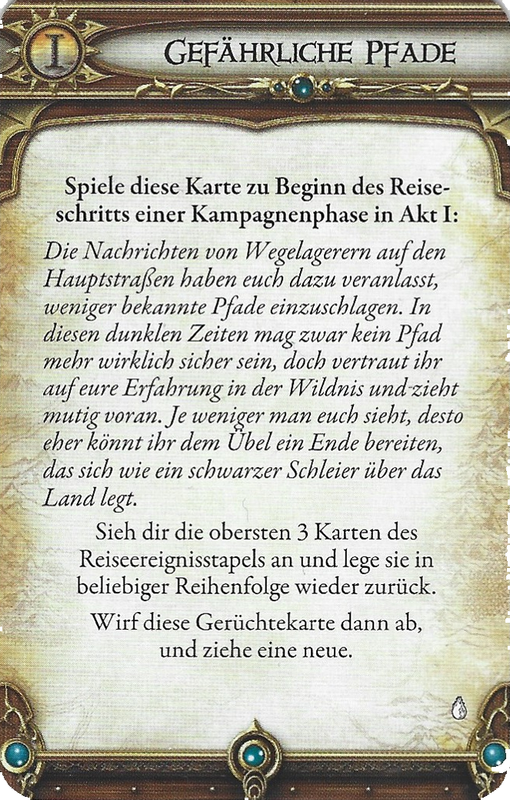

- **xws / Dateiname:** adangerouspath
- **Erweiterung:** lair-of-the-wyrm
- **Akt:** I
- **Reise-Gelände:** —
- **Seiten:** einseitig

**Kartentext (DE, wortgetreu):**

> Spiele diese Karte zu Beginn des Reiseschritts einer Kampagnenphase in Akt I:
>
> *Die Nachrichten von Wegelagerern auf den Hauptstraßen haben euch dazu
> veranlasst, weniger bekannte Pfade einzuschlagen. In diesen dunklen Zeiten mag
> zwar kein Pfad mehr wirklich sicher sein, doch vertraut ihr auf eure Erfahrung
> in der Wildnis und zieht mutig voran. Je weniger man euch sieht, desto eher
> könnt ihr dem Übel ein Ende bereiten, das sich wie ein schwarzer Schleier über
> das Land legt.*
>
> Sieh dir die obersten 3 Karten des Reiseereignisstapels an und lege sie in
> beliebiger Reihenfolge wieder zurück.
>
> Wirf diese Gerüchtekarte dann ab, und ziehe eine neue.

### Böses Erwachen (Rude Awakening)

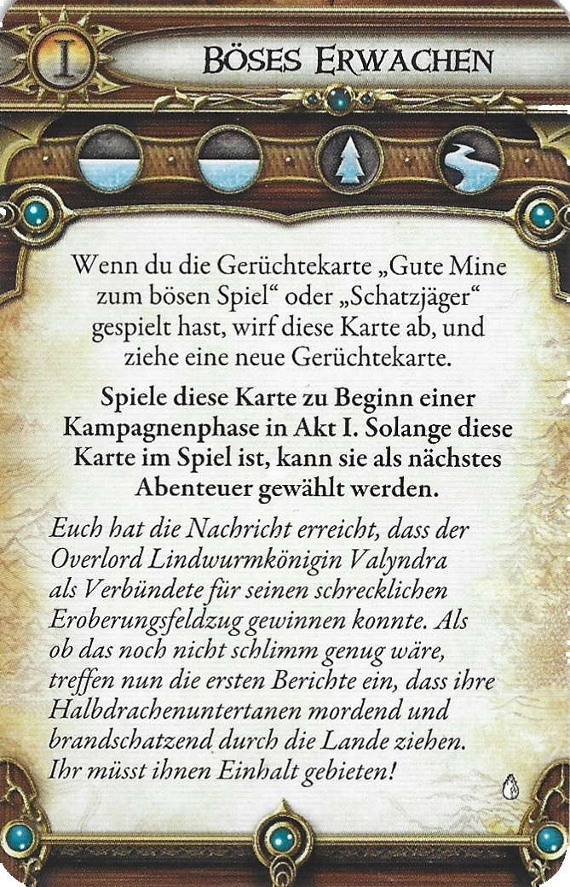

- **xws / Dateiname:** rudeawakening
- **Erweiterung:** lair-of-the-wyrm
- **Akt:** I
- **Reise-Gelände:** —
- **Seiten:** einseitig

**Kartentext (DE, wortgetreu):**

> Wenn du die Gerüchtekarte „Gute Mine zum bösen Spiel" oder „Schatzjäger"
> gespielt hast, wirf diese Karte ab, und ziehe eine neue Gerüchtekarte.
>
> Spiele diese Karte zu Beginn einer Kampagnenphase in Akt I. Solange diese Karte
> im Spiel ist, kann sie als nächstes Abenteuer gewählt werden.
>
> *Euch hat die Nachricht erreicht, dass der Overlord Lindwurmkönigin Valyndra als
> Verbündete für seinen schrecklichen Eroberungsfeldzug gewinnen konnte. Als ob
> das noch nicht schlimm genug wäre, treffen nun die ersten Berichte ein, dass
> ihre Halbdrachenuntertanen mordend und brandschatzend durch die Lande ziehen.
> Ihr müsst ihnen Einhalt gebieten!*

### Schatzjäger (Gold Digger)

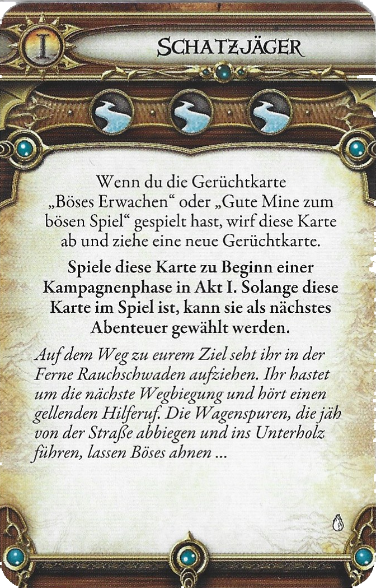

- **xws / Dateiname:** golddigger
- **Erweiterung:** lair-of-the-wyrm
- **Akt:** I
- **Reise-Gelände:** —
- **Seiten:** einseitig

**Kartentext (DE, wortgetreu):**

> Wenn du die Gerüchtekarte „Böses Erwachen" oder „Gute Mine zum bösen Spiel"
> gespielt hast, wirf diese Karte ab und ziehe eine neue Gerüchtekarte.
>
> Spiele diese Karte zu Beginn einer Kampagnenphase in Akt I. Solange diese Karte
> im Spiel ist, kann sie als nächstes Abenteuer gewählt werden.
>
> *Auf dem Weg zu eurem Ziel seht ihr in der Ferne Rauchschwaden aufziehen. Ihr
> hastet um die nächste Wegbiegung und hört einen gellenden Hilferuf. Die
> Wagenspuren, die jäh von der Straße abbiegen und ins Unterholz führen, lassen
> Böses ahnen …*

### Gute Mine zum bösen Spiel (What's Yours Is Mine)

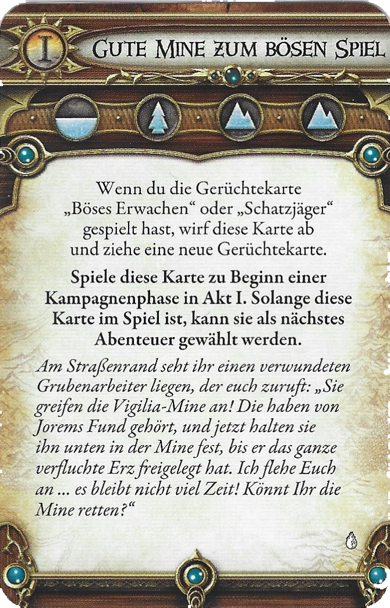

- **xws / Dateiname:** whatsyoursismine
- **Erweiterung:** lair-of-the-wyrm
- **Akt:** I
- **Reise-Gelände:** —
- **Seiten:** einseitig

**Kartentext (DE, wortgetreu):**

> Wenn du die Gerüchtekarte „Böses Erwachen" oder „Schatzjäger" gespielt hast,
> wirf diese Karte ab und ziehe eine neue Gerüchtekarte.
>
> Spiele diese Karte zu Beginn einer Kampagnenphase in Akt I. Solange diese Karte
> im Spiel ist, kann sie als nächstes Abenteuer gewählt werden.
>
> *Am Straßenrand seht ihr einen verwundeten Grubenarbeiter liegen, der euch
> zuruft: „Sie greifen die Vigilia-Mine an! Die haben von Jorems Fund gehört, und
> jetzt halten sie ihn unten in der Mine fest, bis er das ganze verfluchte Erz
> freigelegt hat. Ich flehe Euch an … es bleibt nicht viel Zeit! Könnt Ihr die
> Mine retten?"*

### Zweifelhafte Schätze (Unknown Treasures)

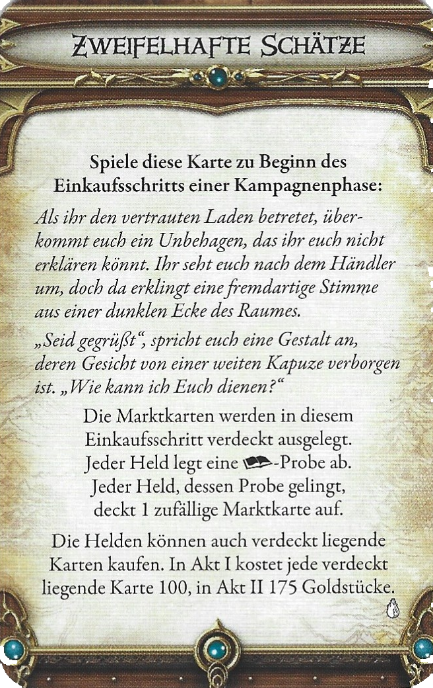

- **xws / Dateiname:** unknowntreasures
- **Erweiterung:** lair-of-the-wyrm
- **Akt:** I
- **Reise-Gelände:** —
- **Seiten:** einseitig

**Kartentext (DE, wortgetreu):**

> Spiele diese Karte zu Beginn des Einkaufsschritts einer Kampagnenphase:
>
> *Als ihr den vertrauten Laden betretet, überkommt euch ein Unbehagen, das ihr
> euch nicht erklären könnt. Ihr seht euch nach dem Händler um, doch da erklingt
> eine fremdartige Stimme aus einer dunklen Ecke des Raumes.*
>
> *„Seid gegrüßt", spricht euch eine Gestalt an, deren Gesicht von einer weiten
> Kapuze verborgen ist. „Wie kann ich Euch dienen?"*
>
> Die Marktkarten werden in diesem Einkaufsschritt verdeckt ausgelegt. Jeder Held
> legt eine [Wissen]-Probe ab. Jeder Held, dessen Probe gelingt, deckt 1 zufällige
> Marktkarte auf.
>
> Die Helden können auch verdeckt liegende Karten kaufen. In Akt I kostet jede
> verdeckt liegende Karte 100, in Akt II 175 Goldstücke.

### Valyndras Zorn (Valyndra's Fury)

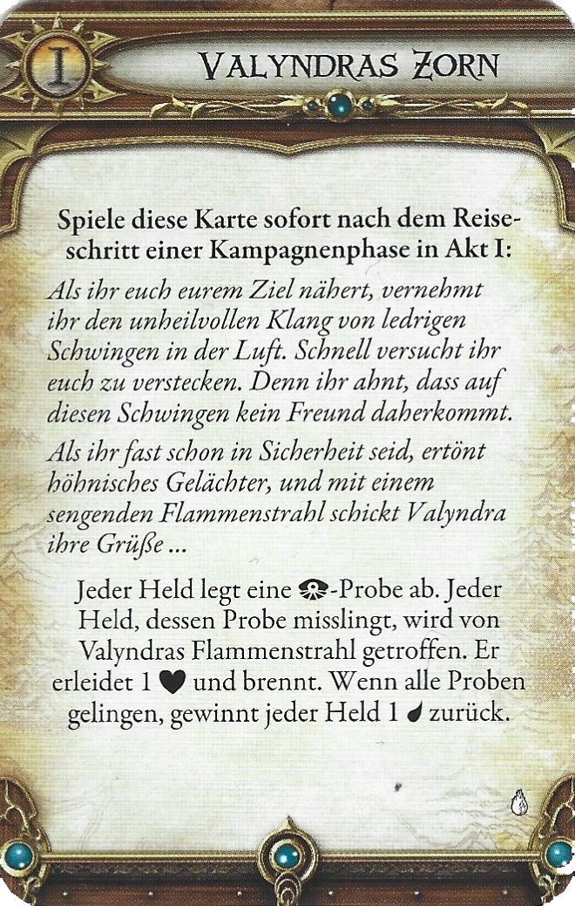

- **xws / Dateiname:** valyndrasfury
- **Erweiterung:** lair-of-the-wyrm
- **Akt:** I
- **Reise-Gelände:** —
- **Seiten:** einseitig

**Kartentext (DE, wortgetreu):**

> Spiele diese Karte sofort nach dem Reiseschritt einer Kampagnenphase in Akt I:
>
> *Als ihr euch eurem Ziel nähert, vernehmt ihr den unheilvollen Klang von
> ledrigen Schwingen in der Luft. Schnell versucht ihr euch zu verstecken. Denn
> ihr ahnt, dass auf diesen Schwingen kein Freund daherkommt.*
>
> *Als ihr fast schon in Sicherheit seid, ertönt höhnisches Gelächter, und mit
> einem sengenden Flammenstrahl schickt Valyndra ihre Grüße …*
>
> Jeder Held legt eine [Gespür]-Probe ab. Jeder Held, dessen Probe misslingt, wird
> von Valyndras Flammenstrahl getroffen. Er erleidet 1 [Schaden] und brennt. Wenn
> alle Proben gelingen, gewinnt jeder Held 1 [Ausdauer] zurück.

---

## Die Trollsümpfe · `the-trollfens` (6)

### Geisterstadt (Ghost Town)

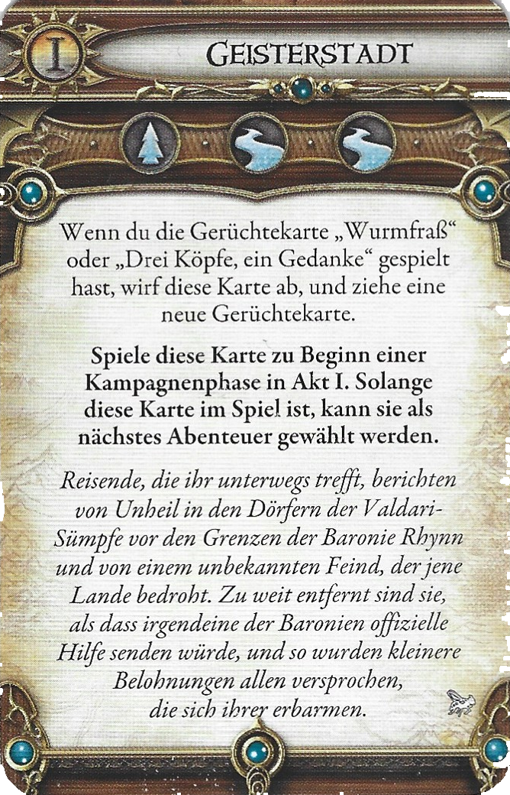

- **xws / Dateiname:** ghosttown
- **Erweiterung:** the-trollfens
- **Akt:** I
- **Reise-Gelände:** —
- **Seiten:** einseitig

**Kartentext (DE, wortgetreu):**

> Wenn du die Gerüchtekarte „Wurmfraß" oder „Drei Köpfe, ein Gedanke" gespielt
> hast, wirf diese Karte ab, und ziehe eine neue Gerüchtekarte.
>
> Spiele diese Karte zu Beginn einer Kampagnenphase in Akt I. Solange diese Karte
> im Spiel ist, kann sie als nächstes Abenteuer gewählt werden.
>
> *Reisende, die ihr unterwegs trefft, berichten von Unheil in den Dörfern der
> Valdari-Sümpfe vor den Grenzen der Baronie Rhynn und von einem unbekannten
> Feind, der jene Lande bedroht. Zu weit entfernt sind sie, als dass irgendeine
> der Baronien offizielle Hilfe senden würde, und so wurden kleinere Belohnungen
> allen versprochen, die sich ihrer erbarmen.*

### Wurmfraß (Food for Worms)

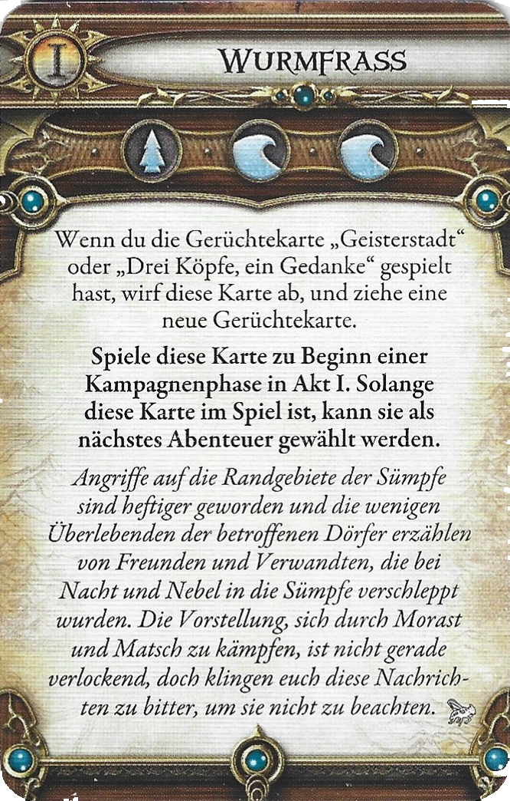

- **xws / Dateiname:** foodforworms
- **Erweiterung:** the-trollfens
- **Akt:** I
- **Reise-Gelände:** —
- **Seiten:** einseitig

**Kartentext (DE, wortgetreu):**

> Wenn du die Gerüchtekarte „Geisterstadt" oder „Drei Köpfe, ein Gedanke"
> gespielt hast, wirf diese Karte ab, und ziehe eine neue Gerüchtekarte.
>
> Spiele diese Karte zu Beginn einer Kampagnenphase in Akt I. Solange diese Karte
> im Spiel ist, kann sie als nächstes Abenteuer gewählt werden.
>
> *Angriffe auf die Randgebiete der Sümpfe sind heftiger geworden und die wenigen
> Überlebenden der betroffenen Dörfer erzählen von Freunden und Verwandten, die
> bei Nacht und Nebel in die Sümpfe verschleppt wurden. Die Vorstellung, sich
> durch Morast und Matsch zu kämpfen, ist nicht gerade verlockend, doch klingen
> euch diese Nachrichten zu bitter, um sie nicht zu beachten.*

### Drei Köpfe, ein Gedanke (Three Heads, One Mind)

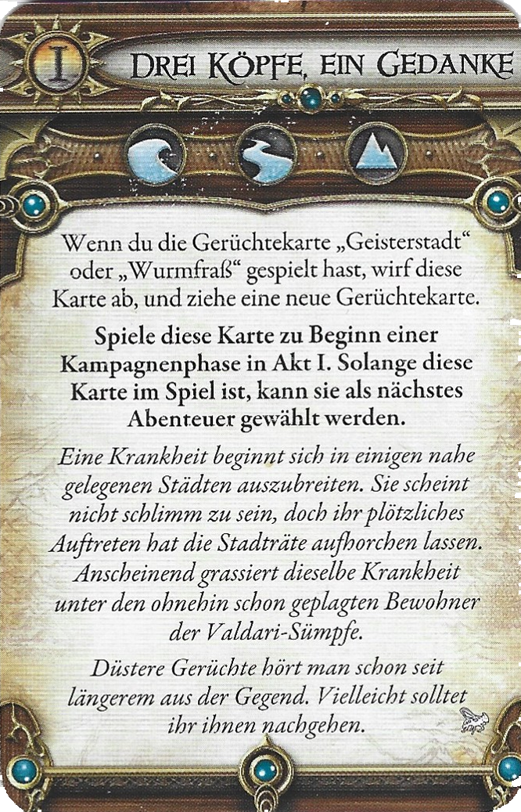

- **xws / Dateiname:** threeheadsonemind
- **Erweiterung:** the-trollfens
- **Akt:** I
- **Reise-Gelände:** —
- **Seiten:** einseitig

**Kartentext (DE, wortgetreu):**

> Wenn du die Gerüchtekarte „Geisterstadt" oder „Wurmfraß" gespielt hast, wirf
> diese Karte ab, und ziehe eine neue Gerüchtekarte.
>
> Spiele diese Karte zu Beginn einer Kampagnenphase in Akt I. Solange diese Karte
> im Spiel ist, kann sie als nächstes Abenteuer gewählt werden.
>
> *Eine Krankheit beginnt sich in einigen nahe gelegenen Städten auszubreiten. Sie
> scheint nicht schlimm zu sein, doch ihr plötzliches Auftreten hat die Stadträte
> aufhorchen lassen. Anscheinend grassiert dieselbe Krankheit unter den ohnehin
> schon geplagten Bewohner der Valdari-Sümpfe.*
>
> *Düstere Gerüchte hört man schon seit längerem aus der Gegend. Vielleicht solltet
> ihr ihnen nachgehen.*

### Schwer erhältliche Waren (Scarce Goods)

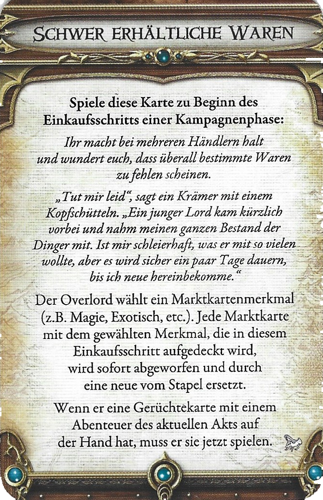

- **xws / Dateiname:** scarcegoods
- **Erweiterung:** the-trollfens
- **Akt:** I
- **Reise-Gelände:** —
- **Seiten:** einseitig

**Kartentext (DE, wortgetreu):**

> Spiele diese Karte zu Beginn des Einkaufsschritts einer Kampagnenphase:
>
> *Ihr macht bei mehreren Händlern halt und wundert euch, dass überall bestimmte
> Waren zu fehlen scheinen.*
>
> *„Tut mir leid", sagt ein Krämer mit einem Kopfschütteln. „Ein junger Lord kam
> kürzlich vorbei und nahm meinen ganzen Bestand der Dinger mit. Ist mir
> schleierhaft, was er mit so vielen wollte, aber es wird sicher ein paar Tage
> dauern, bis ich neue hereinbekomme."*
>
> Der Overlord wählt ein Marktkartenmerkmal (z.B. Magie, Exotisch, etc.). Jede
> Marktkarte mit dem gewählten Merkmal, die in diesem Einkaufsschritt aufgedeckt
> wird, wird sofort abgeworfen und durch eine neue vom Stapel ersetzt.
>
> Wenn ein Held eine Gerüchtekarte mit einem Abenteuer des aktuellen Akts auf der
> Hand hat, muss er sie jetzt spielen.

### Hunger und Not (Famine and Strife)

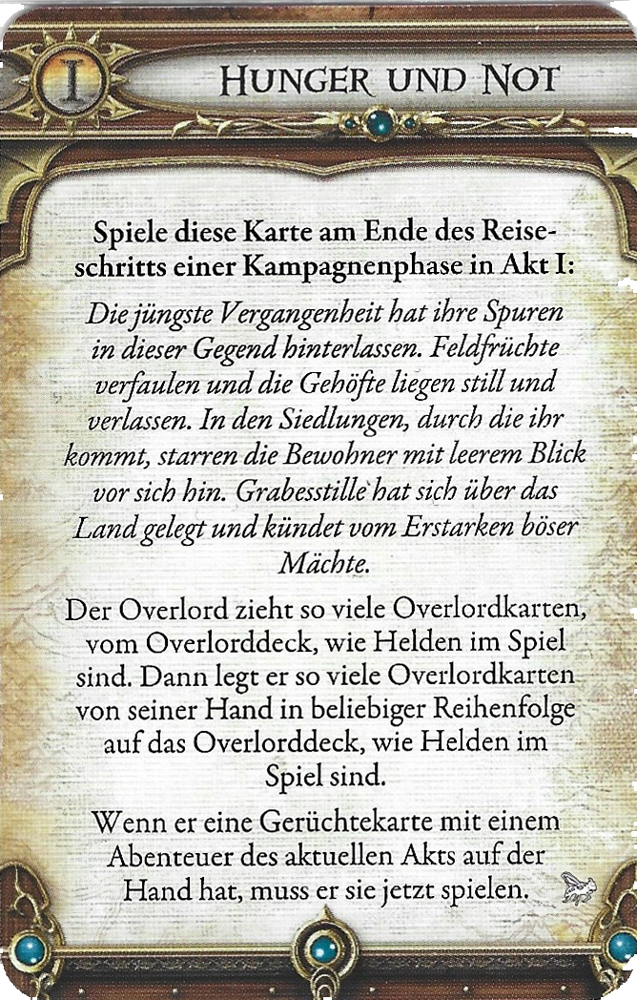

- **xws / Dateiname:** famineandstrife
- **Erweiterung:** the-trollfens
- **Akt:** I
- **Reise-Gelände:** —
- **Seiten:** einseitig

**Kartentext (DE, wortgetreu):**

> Spiele diese Karte am Ende des Reiseschritts einer Kampagnenphase in Akt I:
>
> *Die jüngste Vergangenheit hat ihre Spuren in dieser Gegend hinterlassen.
> Feldfrüchte verfaulen und die Gehöfte liegen still und verlassen. In den
> Siedlungen, durch die ihr kommt, starren die Bewohner mit leerem Blick vor sich
> hin. Grabesstille hat sich über das Land gelegt und kündet vom Erstarken böser
> Mächte.*
>
> Der Overlord zieht so viele Overlordkarten vom Overlorddeck, wie Helden im Spiel
> sind. Dann legt er so viele Overlordkarten von seiner Hand in beliebiger
> Reihenfolge auf das Overlorddeck, wie Helden im Spiel sind.
>
> Wenn er eine Gerüchtekarte mit einem Abenteuer des aktuellen Akts auf der Hand
> hat, muss er sie jetzt spielen.

### Gräueltaten (Atrocities)

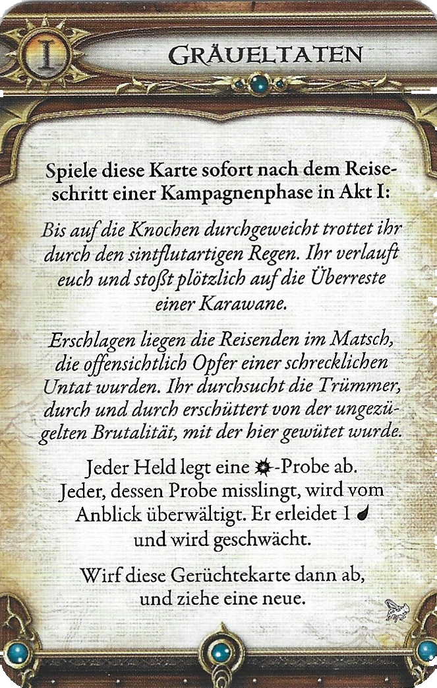

- **xws / Dateiname:** atrocities
- **Erweiterung:** the-trollfens
- **Akt:** I
- **Reise-Gelände:** —
- **Seiten:** einseitig

**Kartentext (DE, wortgetreu):**

> Spiele diese Karte sofort nach dem Reiseschritt einer Kampagnenphase in Akt I:
>
> *Bis auf die Knochen durchgeweicht trottet ihr durch den sintflutartigen Regen.
> Ihr verlauft euch und stoßt plötzlich auf die Überreste einer Karawane.*
>
> *Erschlagen liegen die Reisenden im Matsch, die offensichtlich Opfer einer
> schrecklichen Untat wurden. Ihr durchsucht die Trümmer, durch und durch
> erschüttert von der ungezügelten Brutalität, mit der hier gewütet wurde.*
>
> Jeder Held legt eine [Willenskraft]-Probe ab. Jeder, dessen Probe misslingt,
> wird vom Anblick überwältigt. Er erleidet 1 [Ausdauer] und wird geschwächt.
>
> Wirf diese Gerüchtekarte dann ab, und ziehe eine neue.

---

## Schloss Rabenfels · `manor-of-ravens` (4)

### Der Herr des Hauses (My House, My Rules)

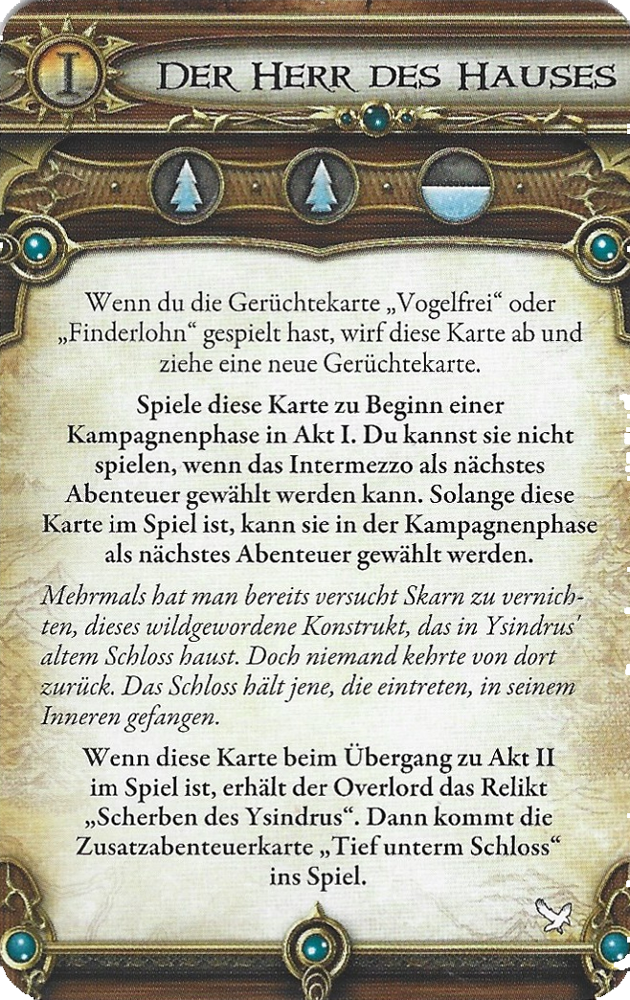

- **xws / Dateiname:** myhousemyrules
- **Erweiterung:** manor-of-ravens
- **Akt:** I
- **Reise-Gelände:** —
- **Seiten:** einseitig

**Kartentext (DE, wortgetreu):**

> Wenn du die Gerüchtekarte „Vogelfrei" oder „Finderlohn" gespielt hast, wirf
> diese Karte ab und ziehe eine neue Gerüchtekarte.
>
> Spiele diese Karte zu Beginn einer Kampagnenphase in Akt I. Du kannst sie nicht
> spielen, wenn das Intermezzo als nächstes Abenteuer gewählt werden kann. Solange
> diese Karte im Spiel ist, kann sie in der Kampagnenphase als nächstes Abenteuer
> gewählt werden.
>
> *Mehrmals hat man bereits versucht Skarn zu vernichten, dieses wildgewordene
> Konstrukt, das in Ysindrus' altem Schloss haust. Doch niemand kehrte von dort
> zurück. Das Schloss hält jene, die eintreten, in seinem Inneren gefangen.*
>
> Wenn diese Karte beim Übergang zu Akt II im Spiel ist, erhält der Overlord das
> Relikt „Scherben des Ysindrus". Dann kommt die Zusatzabenteuerkarte „Tief unterm
> Schloss" ins Spiel.

### Finderlohn (Finders and Keepers)

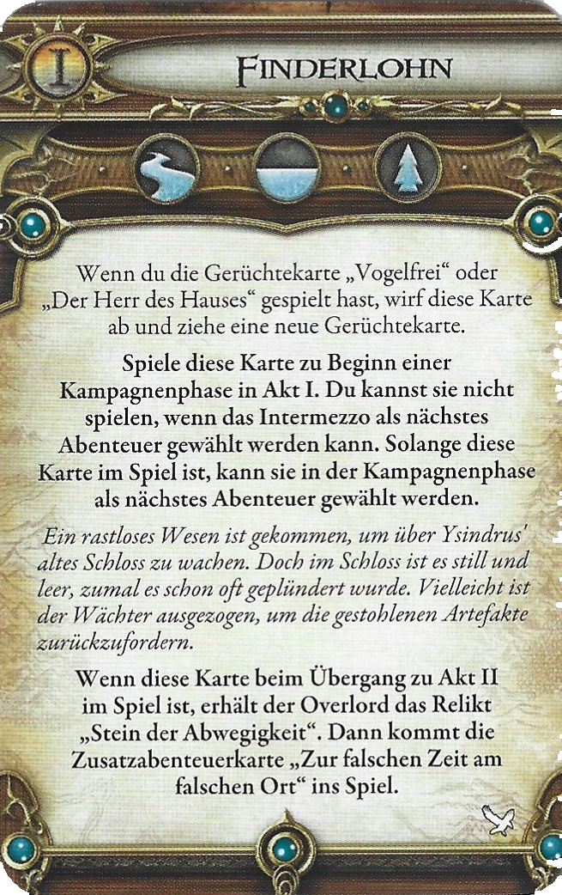

- **xws / Dateiname:** findersandkeepers
- **Erweiterung:** manor-of-ravens
- **Akt:** I
- **Reise-Gelände:** —
- **Seiten:** einseitig

**Kartentext (DE, wortgetreu):**

> Wenn du die Gerüchtekarte „Vogelfrei" oder „Der Herr des Hauses" gespielt hast,
> wirf diese Karte ab und ziehe eine neue Gerüchtekarte.
>
> Spiele diese Karte zu Beginn einer Kampagnenphase in Akt I. Du kannst sie nicht
> spielen, wenn das Intermezzo als nächstes Abenteuer gewählt werden kann. Solange
> diese Karte im Spiel ist, kann sie in der Kampagnenphase als nächstes Abenteuer
> gewählt werden.
>
> *Ein rastloses Wesen ist gekommen, um über Ysindrus' altes Schloss zu wachen.
> Doch im Schloss ist es still und leer, zumal es schon oft geplündert wurde.
> Vielleicht ist der Wächter ausgezogen, um die gestohlenen Artefakte
> zurückzufordern.*
>
> Wenn diese Karte beim Übergang zu Akt II im Spiel ist, erhält der Overlord das
> Relikt „Stein der Abwegigkeit". Dann kommt die Zusatzabenteuerkarte „Zur falschen
> Zeit am falschen Ort" ins Spiel.

### Vogelfrei (Spread Your Wings)

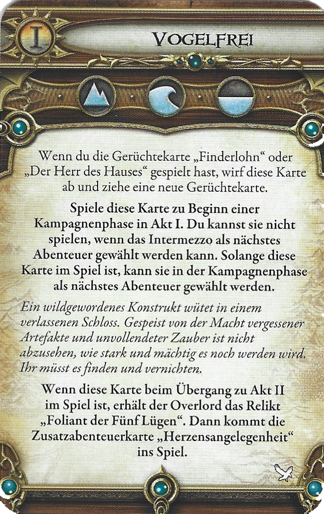

- **xws / Dateiname:** spreadyourwings
- **Erweiterung:** manor-of-ravens
- **Akt:** I
- **Reise-Gelände:** —
- **Seiten:** einseitig

**Kartentext (DE, wortgetreu):**

> Wenn du die Gerüchtekarte „Finderlohn" oder „Der Herr des Hauses" gespielt hast,
> wirf diese Karte ab und ziehe eine neue Gerüchtekarte.
>
> Spiele diese Karte zu Beginn einer Kampagnenphase in Akt I. Du kannst sie nicht
> spielen, wenn das Intermezzo als nächstes Abenteuer gewählt werden kann. Solange
> diese Karte im Spiel ist, kann sie in der Kampagnenphase als nächstes Abenteuer
> gewählt werden.
>
> *Ein wildgewordenes Konstrukt wütet in einem verlassenen Schloss. Gespeist von
> der Macht vergessener Artefakte und unvollendeter Zauber ist nicht abzusehen, wie
> stark und mächtig es noch werden wird. Ihr müsst es finden und vernichten.*
>
> Wenn diese Karte beim Übergang zu Akt II im Spiel ist, erhält der Overlord das
> Relikt „Foliant der Fünf Lügen". Dann kommt die Zusatzabenteuerkarte
> „Herzensangelegenheit" ins Spiel.

### Verfluchte Schätze (Cursed Treasures)

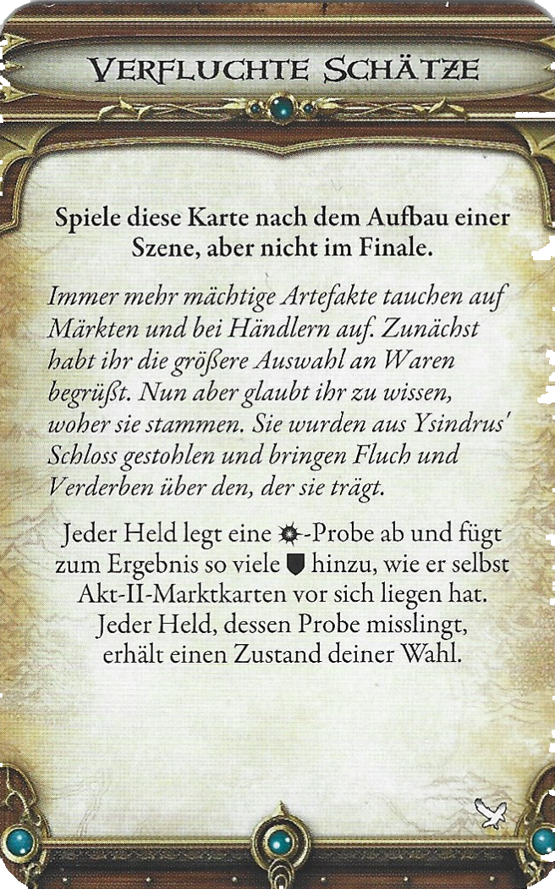

- **xws / Dateiname:** cursedtreasures
- **Erweiterung:** manor-of-ravens
- **Akt:** I
- **Reise-Gelände:** —
- **Seiten:** einseitig

**Kartentext (DE, wortgetreu):**

> Spiele diese Karte nach dem Aufbau einer Szene, aber nicht im Finale.
>
> *Immer mehr mächtige Artefakte tauchen auf Märkten und bei Händlern auf. Zunächst
> habt ihr die größere Auswahl an Waren begrüßt. Nun aber glaubt ihr zu wissen,
> woher sie stammen. Sie wurden aus Ysindrus' Schloss gestohlen und bringen Fluch
> und Verderben über den, der sie trägt.*
>
> Jeder Held legt eine [Willenskraft]-Probe ab und fügt zum Ergebnis so viele
> [Schild] hinzu, wie er selbst Akt-II-Marktkarten vor sich liegen hat. Jeder Held,
> dessen Probe misslingt, erhält einen Zustand deiner Wahl.

---

## Schwur der Verbannten · `oath-of-the-outcast` (1)

### Schwur der Verbannten (Oath of the Outcast)

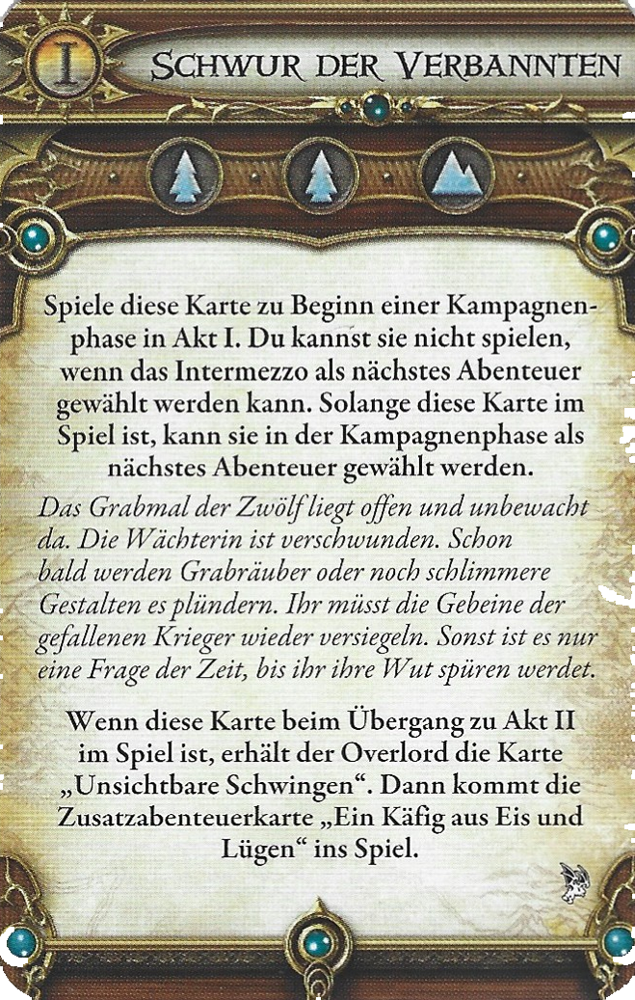

- **xws / Dateiname:** oathoftheoutcast
- **Erweiterung:** oath-of-the-outcast
- **Akt:** I
- **Reise-Gelände:** —
- **Seiten:** einseitig

**Kartentext (DE, wortgetreu):**

> Spiele diese Karte zu Beginn einer Kampagnenphase in Akt I. Du kannst sie nicht
> spielen, wenn das Intermezzo als nächstes Abenteuer gewählt werden kann. Solange
> diese Karte im Spiel ist, kann sie in der Kampagnenphase als nächstes Abenteuer
> gewählt werden.
>
> *Das Grabmal der Zwölf liegt offen und unbewacht da. Die Wächterin ist
> verschwunden. Schon bald werden Grabräuber oder noch schlimmere Gestalten es
> plündern. Ihr müsst die Gebeine der gefallenen Krieger wieder versiegeln. Sonst
> ist es nur eine Frage der Zeit, bis ihr ihre Wut spüren werdet.*
>
> Wenn diese Karte beim Übergang zu Akt II im Spiel ist, erhält der Overlord die
> Karte „Unsichtbare Schwingen". Dann kommt die Zusatzabenteuerkarte „Ein Käfig aus
> Eis und Lügen" ins Spiel.

---

## Krone des Schicksals · `crown-of-destiny` (1)

### Feurige Ernte (Burning Harvest)

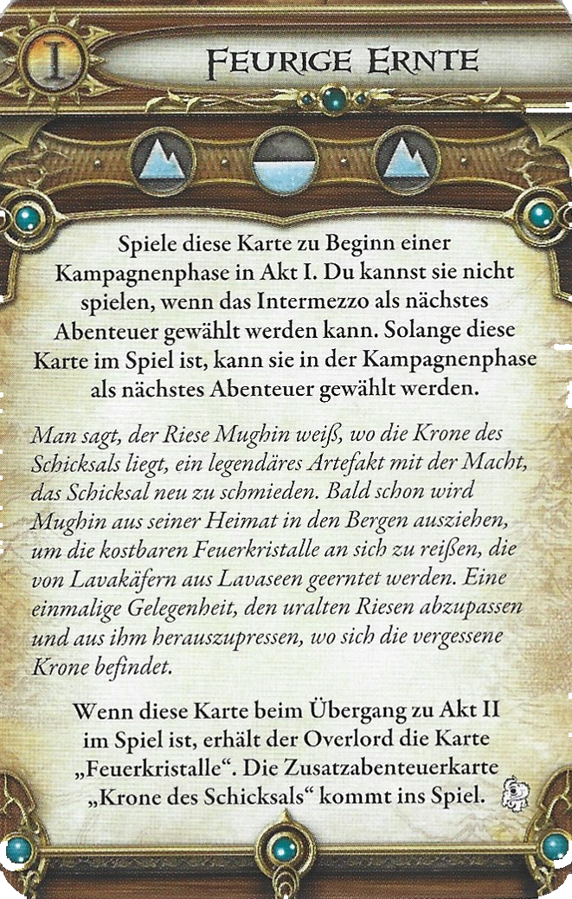

- **xws / Dateiname:** burningharvest
- **Erweiterung:** crown-of-destiny
- **Akt:** I
- **Reise-Gelände:** —
- **Seiten:** einseitig

**Kartentext (DE, wortgetreu):**

> Spiele diese Karte zu Beginn einer Kampagnenphase in Akt I. Du kannst sie nicht
> spielen, wenn das Intermezzo als nächstes Abenteuer gewählt werden kann. Solange
> diese Karte im Spiel ist, kann sie in der Kampagnenphase als nächstes Abenteuer
> gewählt werden.
>
> *Man sagt, der Riese Mughin weiß, wo die Krone des Schicksals liegt, ein
> legendäres Artefakt mit der Macht, das Schicksal neu zu schmieden. Bald schon
> wird Mughin aus seiner Heimat in den Bergen ausziehen, um die kostbaren
> Feuerkristalle an sich zu reißen, die von Lavakäfern aus Lavaseen geerntet
> werden. Eine einmalige Gelegenheit, den uralten Riesen abzupassen und aus ihm
> herauszupressen, wo sich die vergessene Krone befindet.*
>
> Wenn diese Karte beim Übergang zu Akt II im Spiel ist, erhält der Overlord die
> Karte „Feuerkristalle". Die Zusatzabenteuerkarte „Krone des Schicksals" kommt ins
> Spiel.

*(Scan war zweisprachig „Burning Harvest" / „Feurige Ernte"; verwendet wird die
deutsche Karte.)*

---

## Kreuzzug der Vergessenen · `crusade-of-the-forgotten` (1)

### Kreuzzug der Vergessenen (Crusade of the Forgotten)

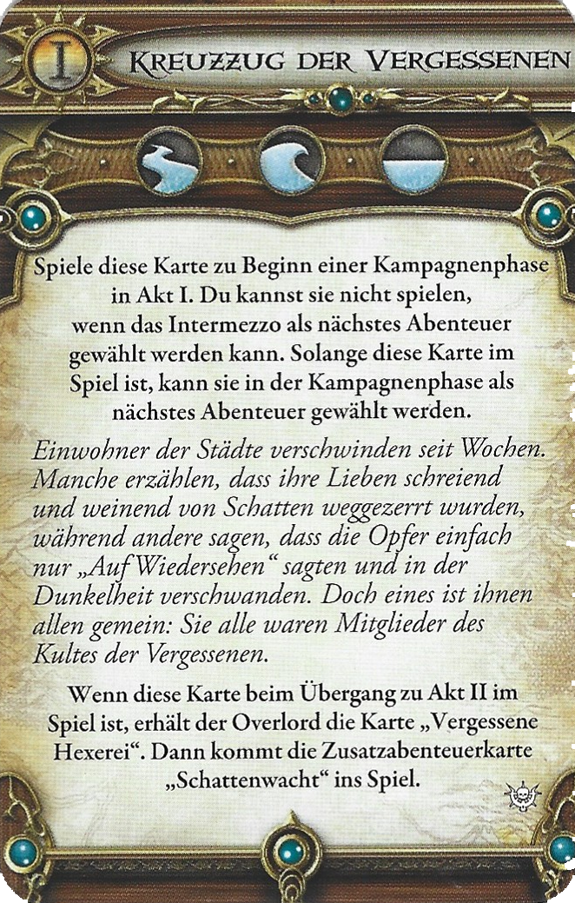

- **xws / Dateiname:** crusadeoftheforgotten
- **Erweiterung:** crusade-of-the-forgotten
- **Akt:** I
- **Reise-Gelände:** —
- **Seiten:** einseitig

**Kartentext (DE, wortgetreu):**

> Spiele diese Karte zu Beginn einer Kampagnenphase in Akt I. Du kannst sie nicht
> spielen, wenn das Intermezzo als nächstes Abenteuer gewählt werden kann. Solange
> diese Karte im Spiel ist, kann sie in der Kampagnenphase als nächstes Abenteuer
> gewählt werden.
>
> *Einwohner der Städte verschwinden seit Wochen. Manche erzählen, dass ihre Lieben
> schreiend und weinend von Schatten weggezerrt wurden, während andere sagen, dass
> die Opfer einfach nur „Auf Wiedersehen" sagten und in der Dunkelheit
> verschwanden. Doch eines ist ihnen allen gemein: Sie alle waren Mitglieder des
> Kultes der Vergessenen.*
>
> Wenn diese Karte beim Übergang zu Akt II im Spiel ist, erhält der Overlord die
> Karte „Vergessene Hexerei". Dann kommt die Zusatzabenteuerkarte „Schattenwacht"
> ins Spiel.

---

## Wächter von Deephall · `guardians-of-deephall` (1)

### Die Wächter von Deephall (Guardians of Deephall)

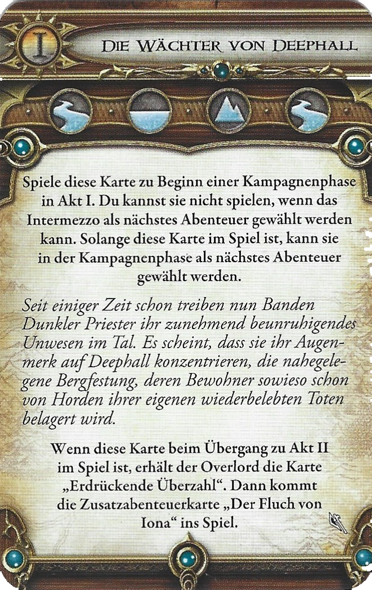

- **xws / Dateiname:** guardiansofdeephall
- **Erweiterung:** guardians-of-deephall
- **Akt:** I
- **Reise-Gelände:** —
- **Seiten:** einseitig

**Kartentext (DE, wortgetreu):**

> Spiele diese Karte zu Beginn einer Kampagnenphase in Akt I. Du kannst sie nicht
> spielen, wenn das Intermezzo als nächstes Abenteuer gewählt werden kann. Solange
> diese Karte im Spiel ist, kann sie in der Kampagnenphase als nächstes Abenteuer
> gewählt werden.
>
> *Seit einiger Zeit schon treiben nun Banden Dunkler Priester ihr zunehmend
> beunruhigendes Unwesen im Tal. Es scheint, dass sie ihr Augenmerk auf Deephall
> konzentrieren, die nahegelegene Bergfestung, deren Bewohner sowieso schon von
> Horden ihrer eigenen wiederbelebten Toten belagert wird.*
>
> Wenn diese Karte beim Übergang zu Akt II im Spiel ist, erhält der Overlord die
> Karte „Erdrückende Überzahl". Dann kommt die Zusatzabenteuerkarte „Der Fluch von
> Iona" ins Spiel.

---

## Prophezeiung eines neuen Anfangs · `visions-of-dawn` (1)

### Friedensbrecher (Trucebreaker)

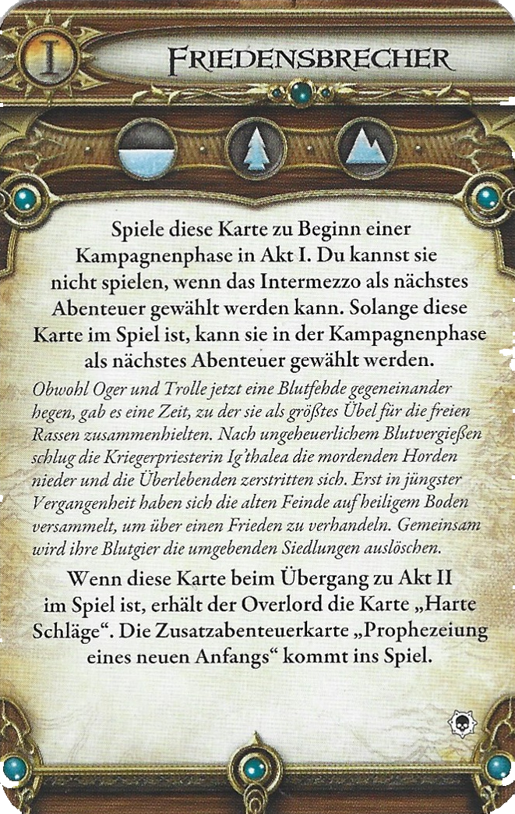

- **xws / Dateiname:** trucebreaker
- **Erweiterung:** visions-of-dawn
- **Akt:** I
- **Reise-Gelände:** —
- **Seiten:** einseitig

**Kartentext (DE, wortgetreu):**

> Spiele diese Karte zu Beginn einer Kampagnenphase in Akt I. Du kannst sie nicht
> spielen, wenn das Intermezzo als nächstes Abenteuer gewählt werden kann. Solange
> diese Karte im Spiel ist, kann sie in der Kampagnenphase als nächstes Abenteuer
> gewählt werden.
>
> *Obwohl Oger und Trolle jetzt eine Blutfehde gegeneinander hegen, gab es eine
> Zeit, zu der sie als größtes Übel für die freien Rassen zusammenhielten. Nach
> ungeheuerlichen Blutvergießen schlug die Kriegerpriesterin Ig'thalea die
> mordenden Horden nieder und die Überlebenden zerstritten sich. Erst in jüngster
> Vergangenheit haben sich die alten Feinde auf heiligem Boden versammelt, um über
> einen Frieden zu verhandeln. Gemeinsam wird ihr Blutgier die umgebenden
> Siedlungen auslöschen.*
>
> Wenn diese Karte beim Übergang zu Akt II im Spiel ist, erhält der Overlord die
> Karte „Harte Schläge". Die Zusatzabenteuerkarte „Prophezeiung eines neuen
> Anfangs" kommt ins Spiel.

---

## Kontrakt der Unbesiegten · `treaty-of-champions` (1)

### Sindaeas Geheimnis (Sindae's Secret)

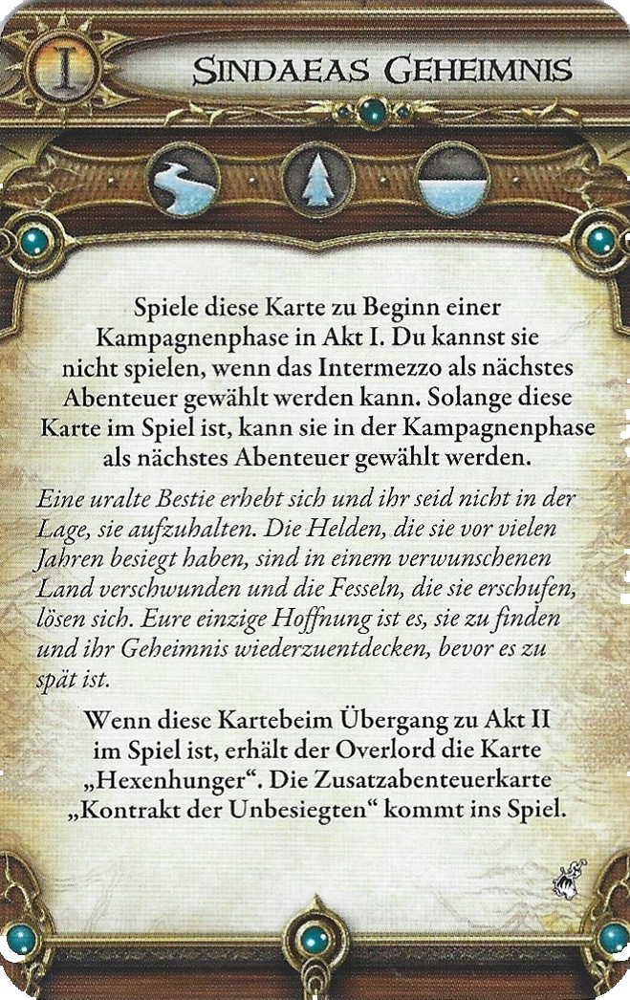

- **xws / Dateiname:** sindaessecret
- **Erweiterung:** treaty-of-champions
- **Akt:** I
- **Reise-Gelände:** —
- **Seiten:** einseitig

**Kartentext (DE, wortgetreu):**

> Spiele diese Karte zu Beginn einer Kampagnenphase in Akt I. Du kannst sie nicht
> spielen, wenn das Intermezzo als nächstes Abenteuer gewählt werden kann. Solange
> diese Karte im Spiel ist, kann sie in der Kampagnenphase als nächstes Abenteuer
> gewählt werden.
>
> *Eine uralte Bestie erhebt sich und ihr seid nicht in der Lage, sie aufzuhalten.
> Die Helden, die sie vor vielen Jahren besiegt haben, sind in einem verwunschenen
> Land verschwunden und die Fesseln, die sie erschufen, lösen sich. Eure einzige
> Hoffnung ist es, sie zu finden und ihr Geheimnis wiederzuentdecken, bevor es zu
> spät ist.*
>
> Wenn diese Karte beim Übergang zu Akt II im Spiel ist, erhält der Overlord die
> Karte „Hexenhunger". Die Zusatzabenteuerkarte „Kontrakt der Unbesiegten" kommt
> ins Spiel.

---

## Hüter des Geheimnisses · `stewards-of-the-secret` (1)

### Hüter des Geheimnisses (Stewards of the Secret)

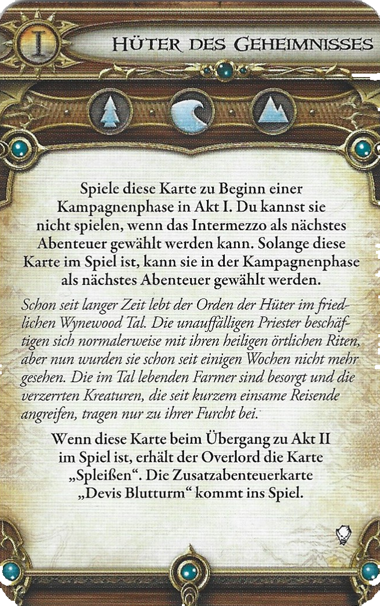

- **xws / Dateiname:** stewardsofthesecret
- **Erweiterung:** stewards-of-the-secret
- **Akt:** I
- **Reise-Gelände:** —
- **Seiten:** einseitig

**Kartentext (DE, wortgetreu):**

> Spiele diese Karte zu Beginn einer Kampagnenphase in Akt I. Du kannst sie nicht
> spielen, wenn das Intermezzo als nächstes Abenteuer gewählt werden kann. Solange
> diese Karte im Spiel ist, kann sie in der Kampagnenphase als nächstes Abenteuer
> gewählt werden.
>
> *Schon seit langer Zeit lebt der Orden der Hüter im friedlichen Wynewood Tal. Die
> unauffälligen Priester beschäftigen sich normalerweise mit ihren heiligen
> örtlichen Riten, aber nun wurden sie schon seit einigen Wochen nicht mehr
> gesehen. Die im Tal lebenden Farmer sind besorgt und die verzerrten Kreaturen,
> die seit kurzem einsame Reisende angreifen, tragen nur zu ihrer Furcht bei.*
>
> Wenn diese Karte beim Übergang zu Akt II im Spiel ist, erhält der Overlord die
> Karte „Spleißen". Die Zusatzabenteuerkarte „Devis Blutturm" kommt ins Spiel.

---

## Scherben von Everdark · `shards-of-everdark` (1)

### Die Scherben von Everdark (Shards of Everdark)

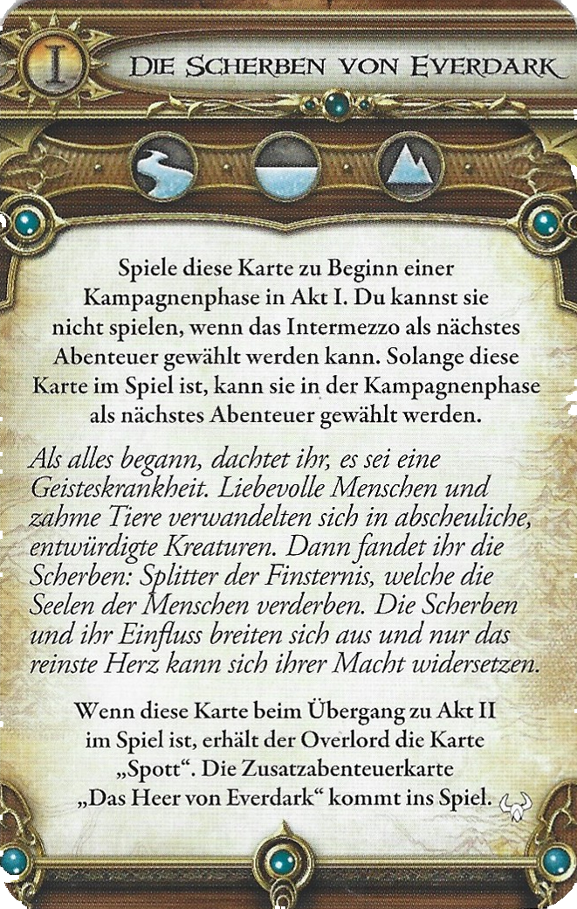

- **xws / Dateiname:** shardsofeverdark
- **Erweiterung:** shards-of-everdark
- **Akt:** I
- **Reise-Gelände:** —
- **Seiten:** einseitig

**Kartentext (DE, wortgetreu):**

> Spiele diese Karte zu Beginn einer Kampagnenphase in Akt I. Du kannst sie nicht
> spielen, wenn das Intermezzo als nächstes Abenteuer gewählt werden kann. Solange
> diese Karte im Spiel ist, kann sie in der Kampagnenphase als nächstes Abenteuer
> gewählt werden.
>
> *Als alles begann, dachtet ihr, es sei eine Geisteskrankheit. Liebevolle Menschen
> und zahme Tiere verwandelten sich in abscheuliche, entwürdigte Kreaturen. Dann
> fandet ihr die Scherben: Splitter der Finsternis, welche die Seelen der Menschen
> verderben. Die Scherben und ihr Einfluss breiten sich aus und nur das reinste
> Herz kann sich ihrer Macht widersetzen.*
>
> Wenn diese Karte beim Übergang zu Akt II im Spiel ist, erhält der Overlord die
> Karte „Spott". Die Zusatzabenteuerkarte „Das Heer von Everdark" kommt ins Spiel.
