# Helden – Heiler

> Quelle: eingescannte **deutsche** Descent-2e-Heldenkarten. Werte und Texte wortgetreu von den Karten übernommen. Bilder: randlos freigestellt (transparenter Hintergrund), volle Auflösung.
>
> **Symbol-Legende:** `[Herz]` Gesundheit/Schaden · `[Ausdauer]` Ausdauer/Erschöpfung · `[Schub]` Schub · `[Schild]` Schild · `[Aktion]` Aktion (Aktions-Pfeil) · `[Bewegung]` Bewegung · `[Stärke]`/`[Willenskraft]`/`[Wissen]`/`[Gespür]` Attributsproben.
>
> **Hinweis:** Inline-Symbole wurden maschinell aus den Scans gelesen; der Fließtext ist wortgetreu. Vereinzelte Symbol-Platzhalter (v. a. `[Schild]`/`[Schub]`) bitte beim Review gegen die Karte prüfen.

---

## Andira Runenhand

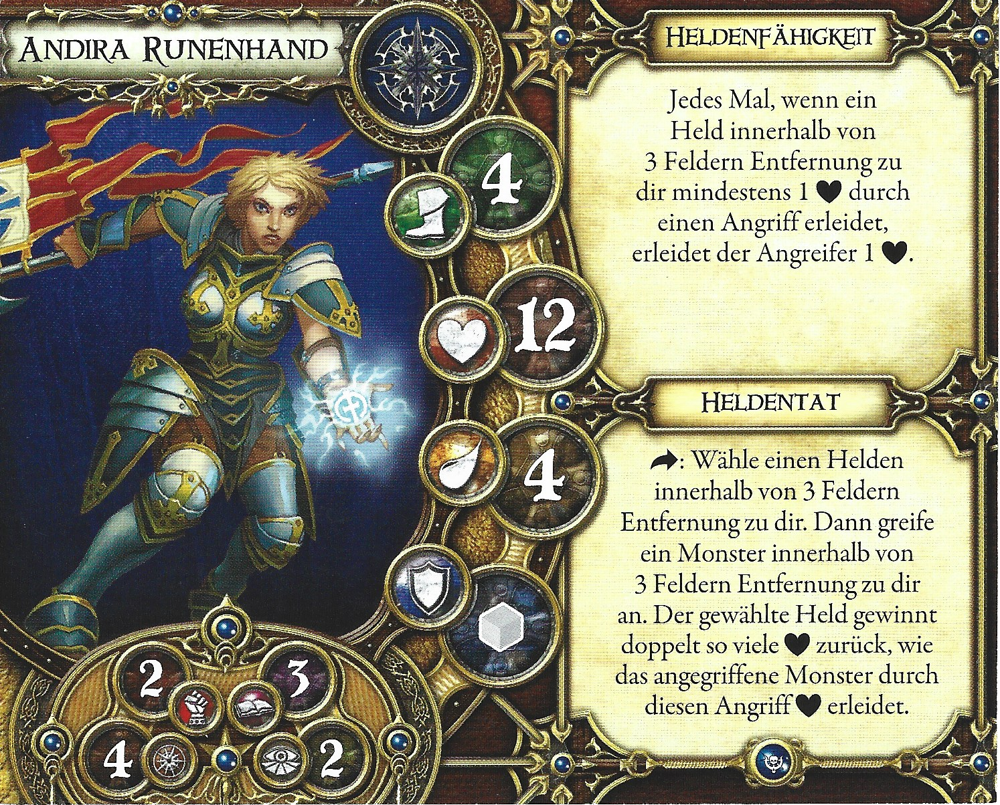

- **Archetyp:** Heiler
- **Erweiterung:** Kreuzzug der Vergessenen
- **Gesundheit:** 12
- **Ausdauer:** 4
- **Geschwindigkeit:** 4
- **Verteidigung:** grau
- **Attribute:**
  - Stärke: 2
  - Willenskraft: 4
  - Wissen: 3
  - Gespür: 2

**Heldenfähigkeit:** Jedes Mal, wenn ein Held innerhalb von 3 Feldern Entfernung zu dir mindestens 1 [Herz] durch einen Angriff erleidet, erleidet der Angreifer 1 [Herz].

**Heldentat:** [Aktion]: Wähle einen Helden innerhalb von 3 Feldern Entfernung zu dir. Dann greife ein Monster innerhalb von 3 Feldern Entfernung zu dir an. Der gewählte Held gewinnt doppelt so viele [Herz] zurück, wie das angegriffene Monster durch diesen Angriff [Herz] erleidet.

---

## Ashrian

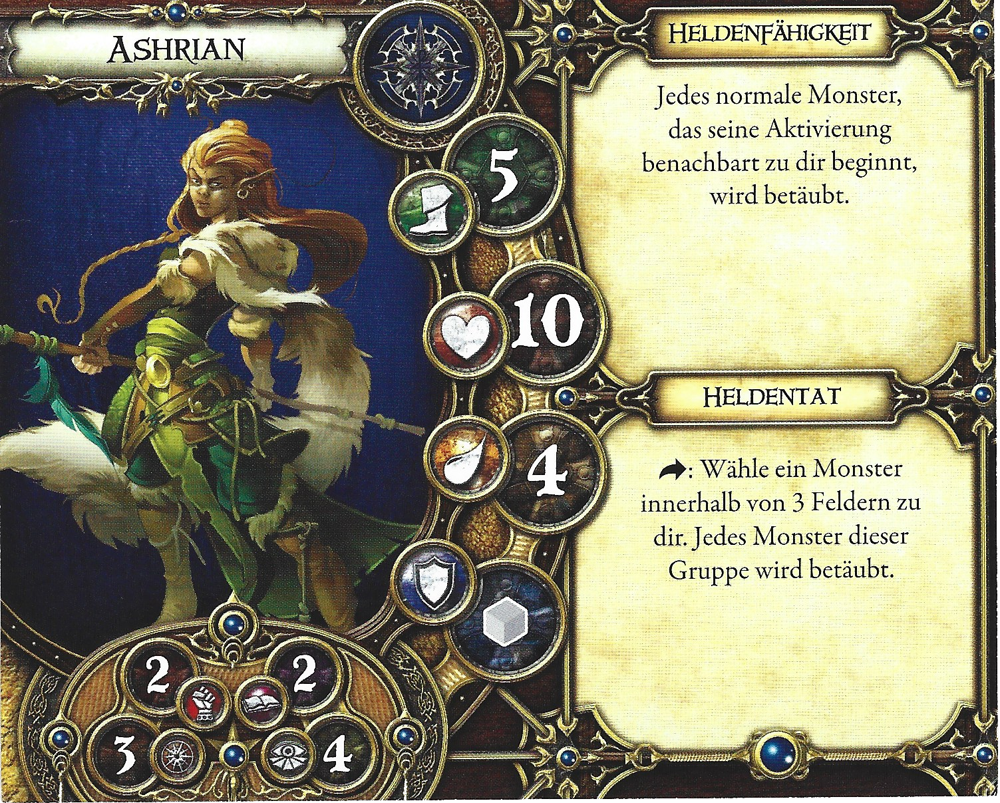

- **Archetyp:** Heiler
- **Erweiterung:** Grundspiel
- **Gesundheit:** 10
- **Ausdauer:** 4
- **Geschwindigkeit:** 5
- **Verteidigung:** grau
- **Attribute:**
  - Stärke: 2
  - Willenskraft: 3
  - Wissen: 2
  - Gespür: 4

**Heldenfähigkeit:** Jedes normale Monster, das seine Aktivierung benachbart zu dir beginnt, wird betäubt.

**Heldentat:** [Aktion]: Wähle ein Monster innerhalb von 3 Feldern zu dir. Jedes Monster dieser Gruppe wird betäubt.

---

## Augur Grisom

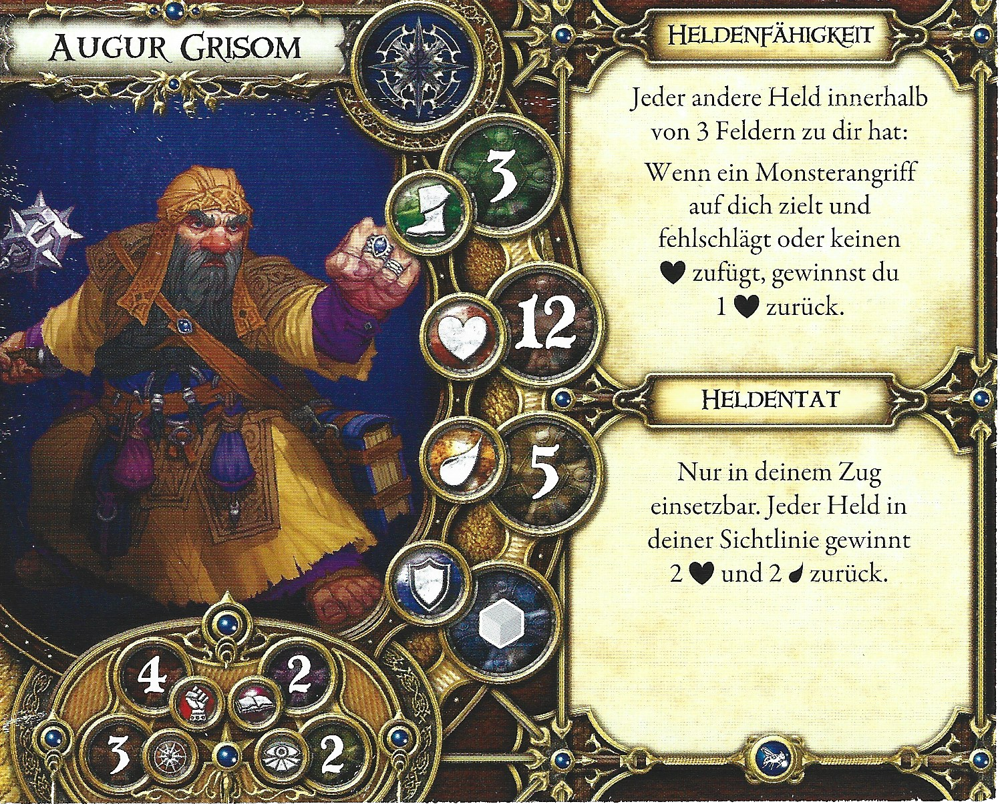

- **Archetyp:** Heiler
- **Erweiterung:** Die Trollsümpfe
- **Gesundheit:** 12
- **Ausdauer:** 5
- **Geschwindigkeit:** 3
- **Verteidigung:** grau
- **Attribute:**
  - Stärke: 4
  - Willenskraft: 3
  - Wissen: 2
  - Gespür: 2

**Heldenfähigkeit:** Jeder andere Held innerhalb von 3 Feldern zu dir hat: Wenn ein Monsterangriff auf dich zielt und fehlschlägt oder keinen [Herz] zufügt, gewinnst du 1 [Herz] zurück.

**Heldentat:** Nur in deinem Zug einsetzbar. Jeder Held in deiner Sichtlinie gewinnt 2 [Herz] und 2 [Ausdauer] zurück.

---

## Avric Albright

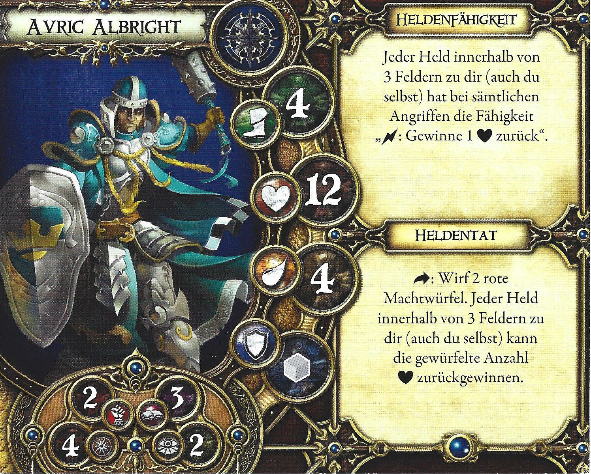

- **Archetyp:** Heiler
- **Erweiterung:** Grundspiel
- **Gesundheit:** 12
- **Ausdauer:** 4
- **Geschwindigkeit:** 4
- **Verteidigung:** grau
- **Attribute:**
  - Stärke: 2
  - Willenskraft: 4
  - Wissen: 3
  - Gespür: 2

**Heldenfähigkeit:** Jeder Held innerhalb von 3 Feldern zu dir (auch du selbst) hat bei sämtlichen Angriffen die Fähigkeit „[Schub]: Gewinne 1 [Herz] zurück“.

**Heldentat:** [Aktion]: Wirf 2 rote Machtwürfel. Jeder Held innerhalb von 3 Feldern zu dir (auch du selbst) kann die gewürfelte Anzahl [Herz] zurückgewinnen.

---

## Bruder Gherinn

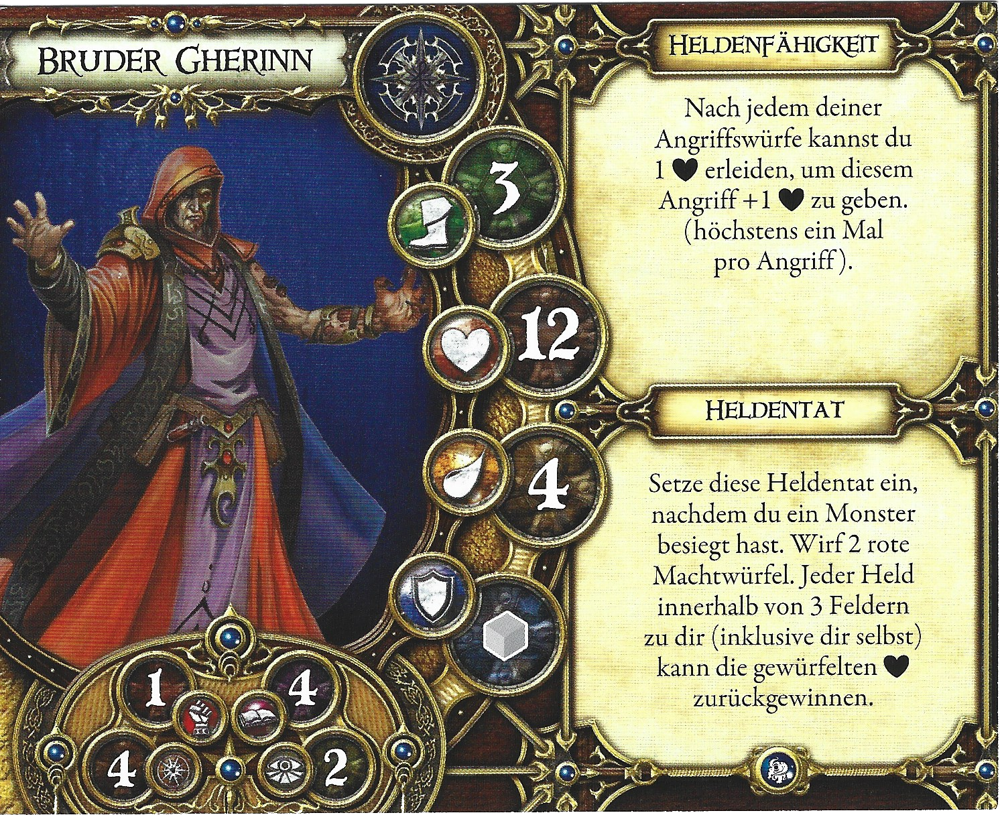

- **Archetyp:** Heiler
- **Erweiterung:** Krone des Schicksals
- **Gesundheit:** 12
- **Ausdauer:** 4
- **Geschwindigkeit:** 3
- **Verteidigung:** grau
- **Attribute:**
  - Stärke: 1
  - Willenskraft: 4
  - Wissen: 4
  - Gespür: 2

**Heldenfähigkeit:** Nach jedem deiner Angriffswürfe kannst du 1 [Herz] erleiden, um diesem Angriff +1 [Herz] zu geben. (höchstens ein Mal pro Angriff).

**Heldentat:** Setze diese Heldentat ein, nachdem du ein Monster besiegt hast. Wirf 2 rote Machtwürfel. Jeder Held innerhalb von 3 Feldern zu dir (inklusive dir selbst) kann die gewürfelten [Herz] zurückgewinnen.

---

## Geistersprecher Mok

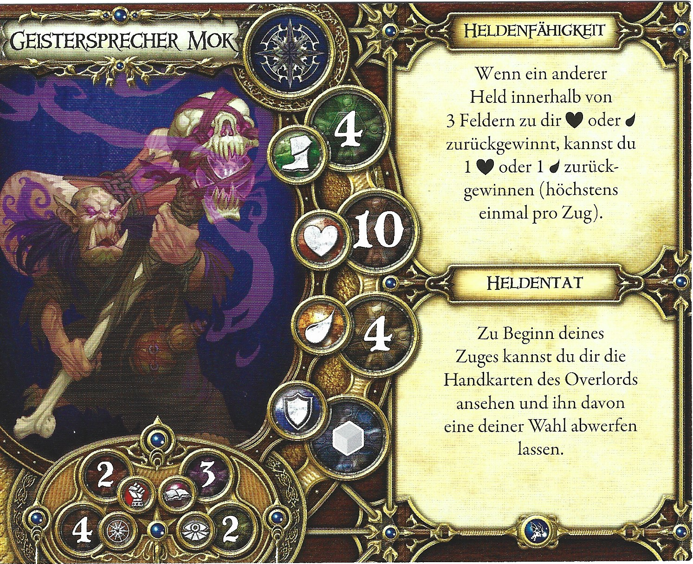

- **Archetyp:** Heiler
- **Erweiterung:** Schwur der Verbannten
- **Gesundheit:** 10
- **Ausdauer:** 4
- **Geschwindigkeit:** 4
- **Verteidigung:** grau
- **Attribute:**
  - Stärke: 2
  - Willenskraft: 4
  - Wissen: 3
  - Gespür: 2

**Heldenfähigkeit:** Wenn ein anderer Held innerhalb von 3 Feldern zu dir [Herz] oder [Ausdauer] zurückgewinnt, kannst du 1 [Herz] oder 1 [Ausdauer] zurückgewinnen (höchstens einmal pro Zug).

**Heldentat:** Zu Beginn deines Zuges kannst du dir die Handkarten des Overlords ansehen und ihn davon eine deiner Wahl abwerfen lassen.

---

## Ispher

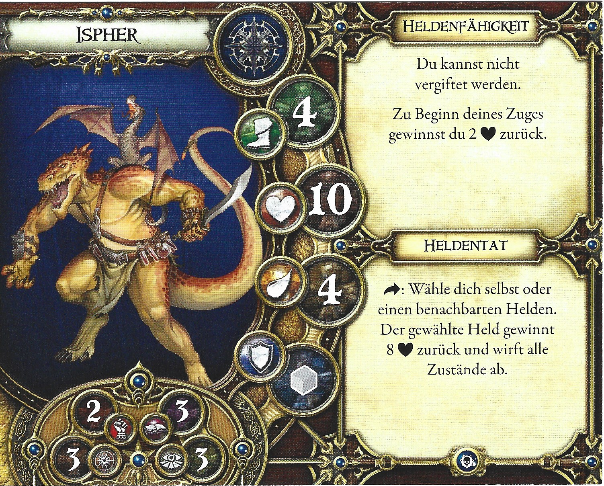

- **Archetyp:** Heiler
- **Erweiterung:** Prophezeiung eines neuen Anfangs
- **Gesundheit:** 10
- **Ausdauer:** 4
- **Geschwindigkeit:** 4
- **Verteidigung:** grau
- **Attribute:**
  - Stärke: 2
  - Willenskraft: 3
  - Wissen: 3
  - Gespür: 3

**Heldenfähigkeit:** Du kannst nicht vergiftet werden. Zu Beginn deines Zuges gewinnst du 2 [Herz] zurück.

**Heldentat:** [Aktion]: Wähle dich selbst oder einen benachbarten Helden. Der gewählte Held gewinnt 8 [Herz] zurück und wirft alle Zustände ab.

---

## Jonas der Gütige

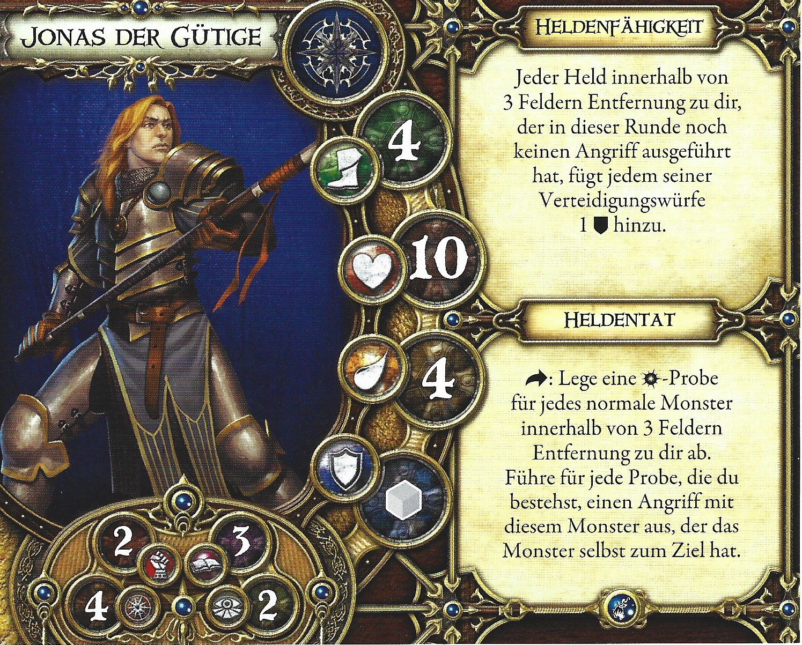

- **Archetyp:** Heiler
- **Erweiterung:** Kontrakt der Unbesiegten
- **Gesundheit:** 10
- **Ausdauer:** 4
- **Geschwindigkeit:** 4
- **Verteidigung:** grau
- **Attribute:**
  - Stärke: 2
  - Willenskraft: 4
  - Wissen: 3
  - Gespür: 2

**Heldenfähigkeit:** Jeder Held innerhalb von 3 Feldern Entfernung zu dir, der in dieser Runde noch keinen Angriff ausgeführt hat, fügt jedem seiner Verteidigungswürfe 1 [Schild] hinzu.

**Heldentat:** [Aktion]: Lege eine [Willenskraft]-Probe für jedes normale Monster innerhalb von 3 Feldern Entfernung zu dir ab. Führe für jede Probe, die du bestehst, einen Angriff mit diesem Monster aus, der das Monster selbst zum Ziel hat.

---

## Okaluk und Rakash

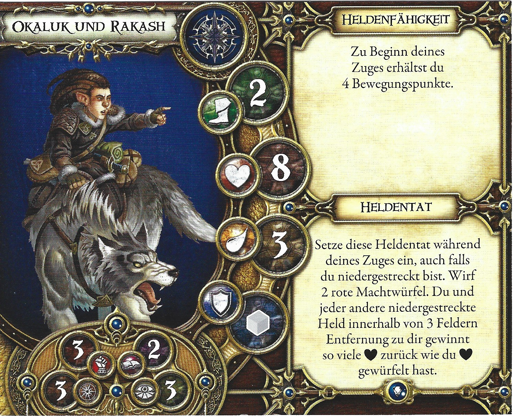

- **Archetyp:** Heiler
- **Erweiterung:** Hüter des Geheimnisses
- **Gesundheit:** 8
- **Ausdauer:** 3
- **Geschwindigkeit:** 2
- **Verteidigung:** grau
- **Attribute:**
  - Stärke: 3
  - Willenskraft: 3
  - Wissen: 2
  - Gespür: 3

**Heldenfähigkeit:** Zu Beginn deines Zuges erhältst du 4 Bewegungspunkte.

**Heldentat:** Setze diese Heldentat während deines Zuges ein, auch falls du niedergestreckt bist. Wirf 2 rote Machtwürfel. Du und jeder andere niedergestreckte Held innerhalb von 3 Feldern Entfernung zu dir gewinnt so viele [Herz] zurück wie du [Herz] gewürfelt hast.

---

## Rendiel

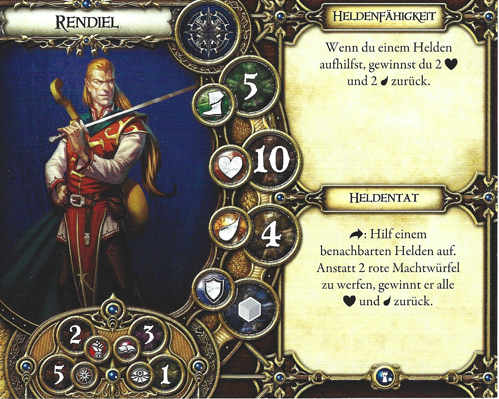

- **Archetyp:** Heiler
- **Erweiterung:** Schatten von Nerekhall
- **Gesundheit:** 10
- **Ausdauer:** 4
- **Geschwindigkeit:** 5
- **Verteidigung:** grau
- **Attribute:**
  - Stärke: 2
  - Willenskraft: 5
  - Wissen: 3
  - Gespür: 1

**Heldenfähigkeit:** Wenn du einem Helden aufhilfst, gewinnst du 2 [Herz] und 2 [Ausdauer] zurück.

**Heldentat:** [Aktion]: Hilf einem benachbarten Helden auf. Anstatt 2 rote Machtwürfel zu werfen, gewinnt er alle [Herz] und [Ausdauer] zurück.

---

## Sahla

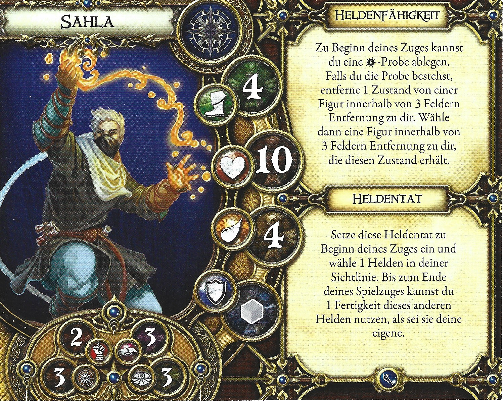

- **Archetyp:** Heiler
- **Erweiterung:** Wächter von Deephall
- **Gesundheit:** 10
- **Ausdauer:** 4
- **Geschwindigkeit:** 4
- **Verteidigung:** grau
- **Attribute:**
  - Stärke: 2
  - Willenskraft: 3
  - Wissen: 3
  - Gespür: 3

**Heldenfähigkeit:** Zu Beginn deines Zuges kannst du eine [Willenskraft]-Probe ablegen. Falls du die Probe bestehst, entferne 1 Zustand von einer Figur innerhalb von 3 Feldern Entfernung zu dir. Wähle dann eine Figur innerhalb von 3 Feldern Entfernung zu dir, die diesen Zustand erhält.

**Heldentat:** Setze diese Heldentat zu Beginn deines Zuges ein und wähle 1 Helden in deiner Sichtlinie. Bis zum Ende deines Spielzuges kannst du 1 Fertigkeit dieses anderen Helden nutzen, als sei sie deine eigene.

---

## Ulma Grimstone

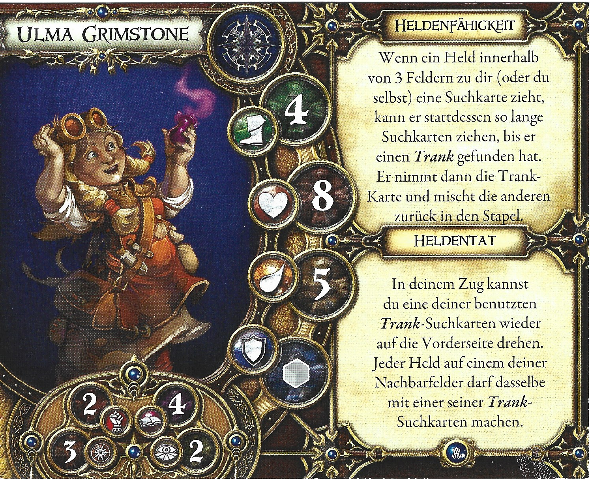

- **Archetyp:** Heiler
- **Erweiterung:** Labyrinth des Verderbens
- **Gesundheit:** 8
- **Ausdauer:** 5
- **Geschwindigkeit:** 4
- **Verteidigung:** grau
- **Attribute:**
  - Stärke: 2
  - Willenskraft: 3
  - Wissen: 4
  - Gespür: 2

**Heldenfähigkeit:** Wenn ein Held innerhalb von 3 Feldern zu dir (oder du selbst) eine Suchkarte zieht, kann er stattdessen so lange Suchkarten ziehen, bis er einen Trank gefunden hat. Er nimmt dann die Trank-Karte und mischt die anderen zurück in den Stapel.

**Heldentat:** In deinem Zug kannst du eine deiner benutzten Trank-Suchkarten wieder auf die Vorderseite drehen. Jeder Held auf einem deiner Nachbarfelder darf dasselbe mit einer seiner Trank-Suchkarten machen.

---

