# Helden – Krieger

> Quelle: eingescannte **deutsche** Descent-2e-Heldenkarten. Werte und Texte wortgetreu von den Karten übernommen. Bilder: randlos freigestellt (transparenter Hintergrund), volle Auflösung.
>
> **Symbol-Legende:** `[Herz]` Gesundheit/Schaden · `[Ausdauer]` Ausdauer/Erschöpfung · `[Schub]` Schub · `[Schild]` Schild · `[Aktion]` Aktion (Aktions-Pfeil) · `[Bewegung]` Bewegung · `[Stärke]`/`[Willenskraft]`/`[Wissen]`/`[Gespür]` Attributsproben.
>
> **Hinweis:** Inline-Symbole wurden maschinell aus den Scans gelesen; der Fließtext ist wortgetreu. Vereinzelte Symbol-Platzhalter (v. a. `[Schild]`/`[Schub]`) bitte beim Review gegen die Karte prüfen.

---

## Alys Raine

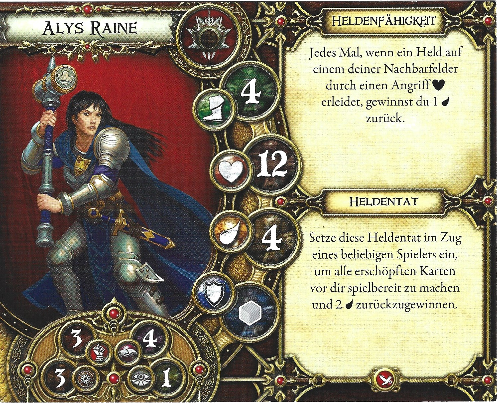

- **Archetyp:** Krieger
- **Erweiterung:** Schloss Rabenfels
- **Gesundheit:** 12
- **Ausdauer:** 4
- **Geschwindigkeit:** 4
- **Verteidigung:** grau
- **Attribute:**
  - Stärke: 3
  - Willenskraft: 3
  - Wissen: 4
  - Gespür: 1

**Heldenfähigkeit:** Jedes Mal, wenn ein Held auf einem deiner Nachbarfelder durch einen Angriff [Herz] erleidet, gewinnst du 1 [Ausdauer] zurück.

**Heldentat:** Setze diese Heldentat im Zug eines beliebigen Spielers ein, um alle erschöpften Karten vor dir spielbereit zu machen und 2 [Ausdauer] zurückzugewinnen.

---

## Corbin

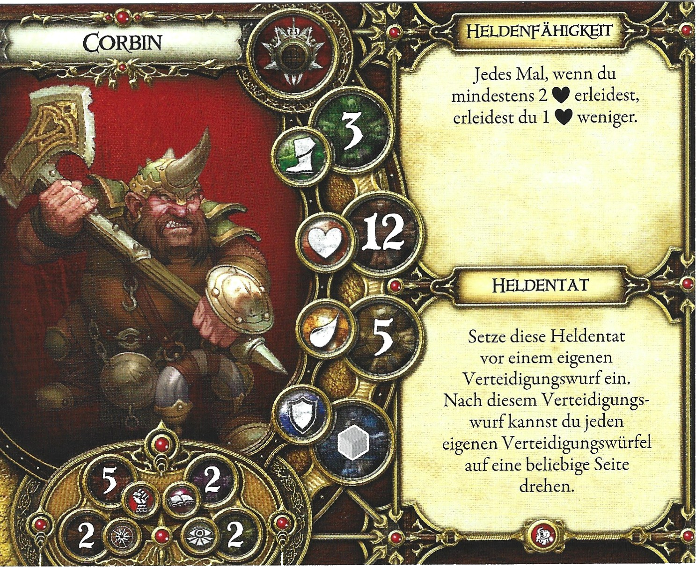

- **Archetyp:** Krieger
- **Erweiterung:** Krone des Schicksals
- **Gesundheit:** 12
- **Ausdauer:** 5
- **Geschwindigkeit:** 3
- **Verteidigung:** grau
- **Attribute:**
  - Stärke: 5
  - Willenskraft: 2
  - Wissen: 2
  - Gespür: 2

**Heldenfähigkeit:** Jedes Mal, wenn du mindestens 2 [Herz] erleidest, erleidest du 1 [Herz] weniger.

**Heldentat:** Setze diese Heldentat vor einem eigenen Verteidigungswurf ein. Nach diesem Verteidigungswurf kannst du jeden eigenen Verteidigungswürfel auf eine beliebige Seite drehen.

---

## Einfaust

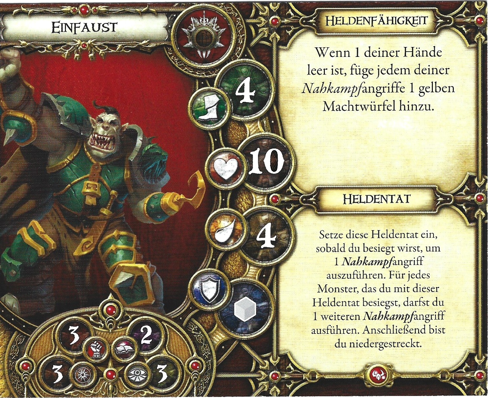

- **Archetyp:** Krieger
- **Erweiterung:** Scherben von Everdark
- **Gesundheit:** 10
- **Ausdauer:** 4
- **Geschwindigkeit:** 4
- **Verteidigung:** grau
- **Attribute:**
  - Stärke: 3
  - Willenskraft: 3
  - Wissen: 2
  - Gespür: 3

**Heldenfähigkeit:** Wenn 1 deiner Hände leer ist, füge jedem deiner Nahkampfangriffe 1 gelben Machtwürfel hinzu.

**Heldentat:** Setze diese Heldentat ein, sobald du besiegt wirst, um 1 Nahkampfangriff auszuführen. Für jedes Monster, das du mit dieser Heldentat besiegst, darfst du 1 weiteren Nahkampfangriff ausführen. Anschließend bist du niedergestreckt.

---

## Grisban der Durstige

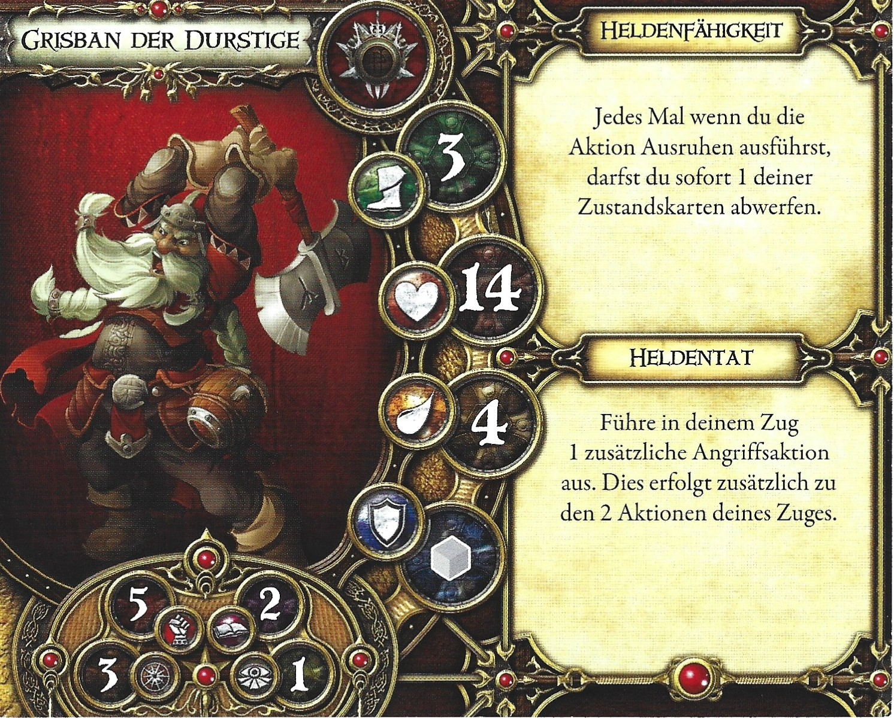

- **Archetyp:** Krieger
- **Erweiterung:** Grundspiel
- **Gesundheit:** 14
- **Ausdauer:** 4
- **Geschwindigkeit:** 3
- **Verteidigung:** grau
- **Attribute:**
  - Stärke: 5
  - Willenskraft: 3
  - Wissen: 2
  - Gespür: 1

**Heldenfähigkeit:** Jedes Mal wenn du die Aktion Ausruhen ausführst, darfst du sofort 1 deiner Zustandskarten abwerfen.

**Heldentat:** Führe in deinem Zug 1 zusätzliche Angriffsaktion aus. Dies erfolgt zusätzlich zu den 2 Aktionen deines Zuges.

---

## Karnon

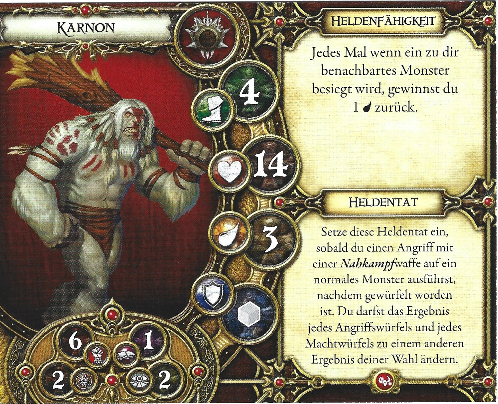

- **Archetyp:** Krieger
- **Erweiterung:** Scherben von Everdark
- **Gesundheit:** 14
- **Ausdauer:** 3
- **Geschwindigkeit:** 4
- **Verteidigung:** grau
- **Attribute:**
  - Stärke: 6
  - Willenskraft: 2
  - Wissen: 1
  - Gespür: 2

**Heldenfähigkeit:** Jedes Mal wenn ein zu dir benachbartes Monster besiegt wird, gewinnst du 1 [Ausdauer] zurück.

**Heldentat:** Setze diese Heldentat ein, sobald du einen Angriff mit einer Nahkampfwaffe auf ein normales Monster ausführst, nachdem gewürfelt worden ist. Du darfst das Ergebnis jedes Angriffswürfels und jedes Machtwürfels zu einem anderen Ergebnis deiner Wahl ändern.

---

## Krutzbeck

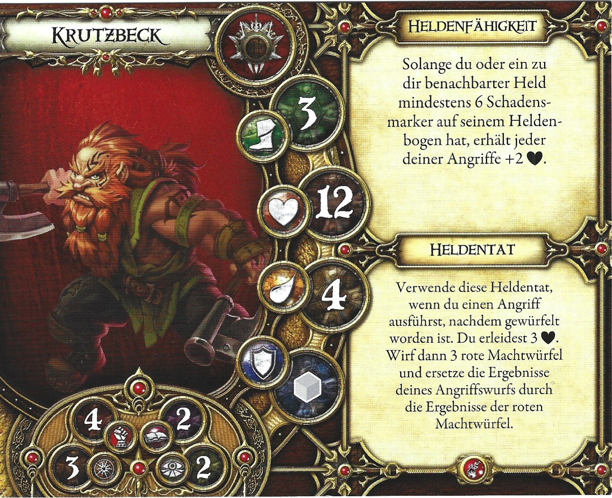

- **Archetyp:** Krieger
- **Erweiterung:** Kontrakt der Unbesiegten
- **Gesundheit:** 12
- **Ausdauer:** 4
- **Geschwindigkeit:** 3
- **Verteidigung:** grau
- **Attribute:**
  - Stärke: 4
  - Willenskraft: 3
  - Wissen: 2
  - Gespür: 2

**Heldenfähigkeit:** Solange du oder ein zu dir benachbarter Held mindestens 6 Schadensmarker auf seinem Heldenbogen hat, erhält jeder deiner Angriffe +2 [Herz].

**Heldentat:** Verwende diese Heldentat, wenn du einen Angriff ausführst, nachdem gewürfelt worden ist. Du erleidest 3 [Herz]. Wirf dann 3 rote Machtwürfel und ersetze die Ergebnisse deines Angriffswurfs durch die Ergebnisse der roten Machtwürfel.

---

## Kundschafter Durik

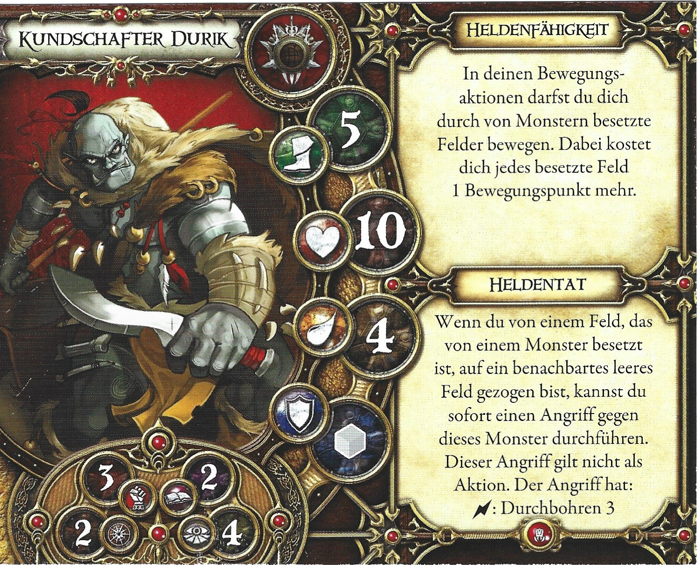

- **Archetyp:** Krieger
- **Erweiterung:** Labyrinth des Verderbens
- **Gesundheit:** 10
- **Ausdauer:** 4
- **Geschwindigkeit:** 5
- **Verteidigung:** grau
- **Attribute:**
  - Stärke: 3
  - Willenskraft: 2
  - Wissen: 2
  - Gespür: 4

**Heldenfähigkeit:** In deinen Bewegungsaktionen darfst du dich durch von Monstern besetzte Felder bewegen. Dabei kostet dich jedes besetzte Feld 1 Bewegungspunkt mehr.

**Heldentat:** Wenn du von einem Feld, das von einem Monster besetzt ist, auf ein benachbartes leeres Feld gezogen bist, kannst du sofort einen Angriff gegen dieses Monster durchführen. Dieser Angriff gilt nicht als Aktion. Der Angriff hat: [Schub]: Durchbohren 3

---

## Lord Hawthorne

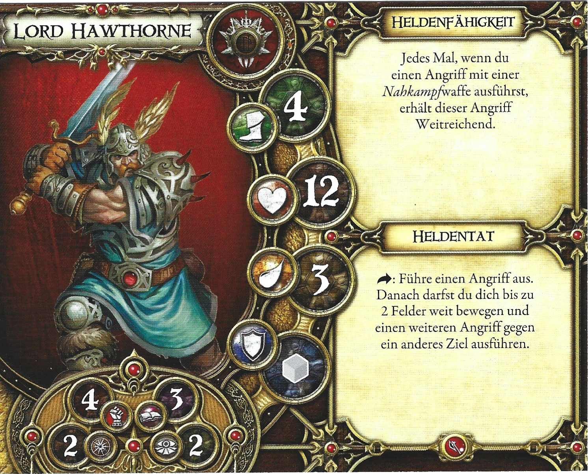

- **Archetyp:** Krieger
- **Erweiterung:** Wächter von Deephall
- **Gesundheit:** 12
- **Ausdauer:** 3
- **Geschwindigkeit:** 4
- **Verteidigung:** grau
- **Attribute:**
  - Stärke: 4
  - Willenskraft: 2
  - Wissen: 3
  - Gespür: 2

**Heldenfähigkeit:** Jedes Mal, wenn du einen Angriff mit einer Nahkampfwaffe ausführst, erhält dieser Angriff Weitreichend.

**Heldentat:** [Aktion]: Führe einen Angriff aus. Danach darfst du dich bis zu 2 Felder weit bewegen und einen weiteren Angriff gegen ein anderes Ziel ausführen.

---

## Mordrog

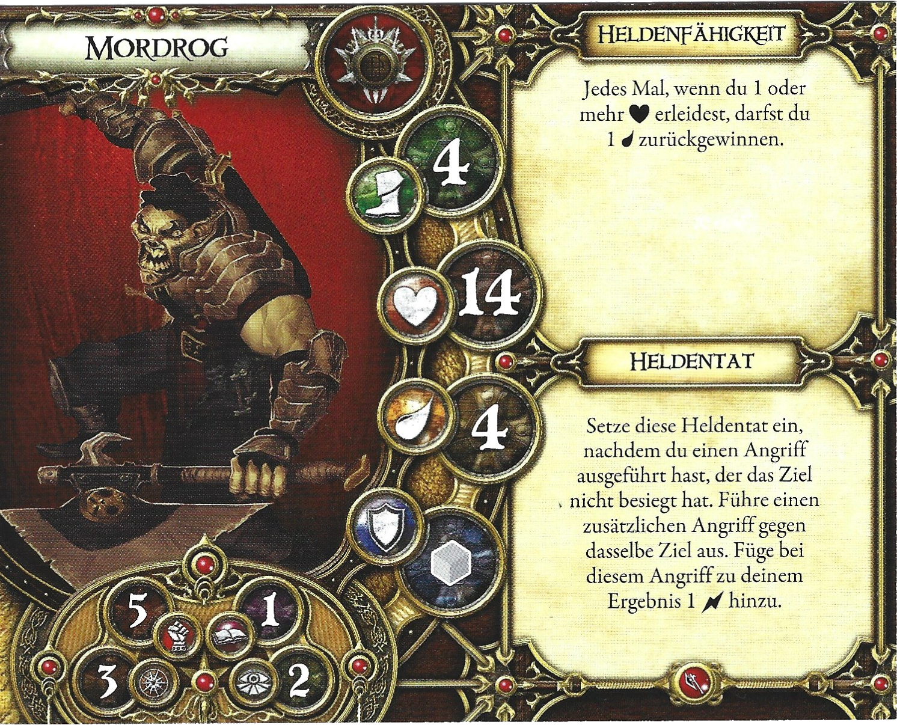

- **Archetyp:** Krieger
- **Erweiterung:** Wächter von Deephall
- **Gesundheit:** 14
- **Ausdauer:** 4
- **Geschwindigkeit:** 4
- **Verteidigung:** grau
- **Attribute:**
  - Stärke: 5
  - Willenskraft: 3
  - Wissen: 1
  - Gespür: 2

**Heldenfähigkeit:** Jedes Mal, wenn du 1 oder mehr [Herz] erleidest, darfst du 1 [Ausdauer] zurückgewinnen.

**Heldentat:** Setze diese Heldentat ein, nachdem du einen Angriff ausgeführt hast, der das Ziel nicht besiegt hat. Führe einen zusätzlichen Angriff gegen dasselbe Ziel aus. Füge bei diesem Angriff zu deinem Ergebnis 1 [Schub] hinzu.

---

## Nanok die Klinge

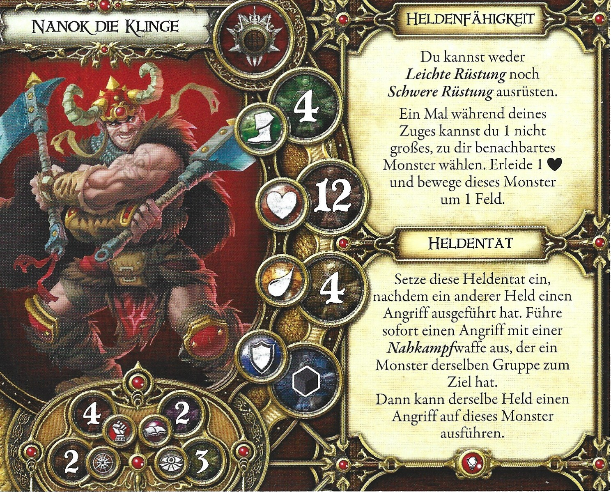

- **Archetyp:** Krieger
- **Erweiterung:** Hüter des Geheimnisses
- **Gesundheit:** 12
- **Ausdauer:** 4
- **Geschwindigkeit:** 4
- **Verteidigung:** grau *(Scan nicht eindeutig; heroes.ts: schwarz)*
- **Attribute:**
  - Stärke: 4
  - Willenskraft: 2
  - Wissen: 2
  - Gespür: 3

**Heldenfähigkeit:** Du kannst weder Leichte Rüstung noch Schwere Rüstung ausrüsten. Ein Mal während deines Zuges kannst du 1 nicht großes, zu dir benachbartes Monster wählen. Erleide 1 [Herz] und bewege dieses Monster um 1 Feld.

**Heldentat:** Setze diese Heldentat ein, nachdem ein anderer Held einen Angriff ausgeführt hat. Führe sofort einen Angriff mit einer Nahkampfwaffe aus, der ein Monster derselben Gruppe zum Ziel hat. Dann kann derselbe Held einen Angriff auf dieses Monster ausführen.

---

## Nara der Reißzahn

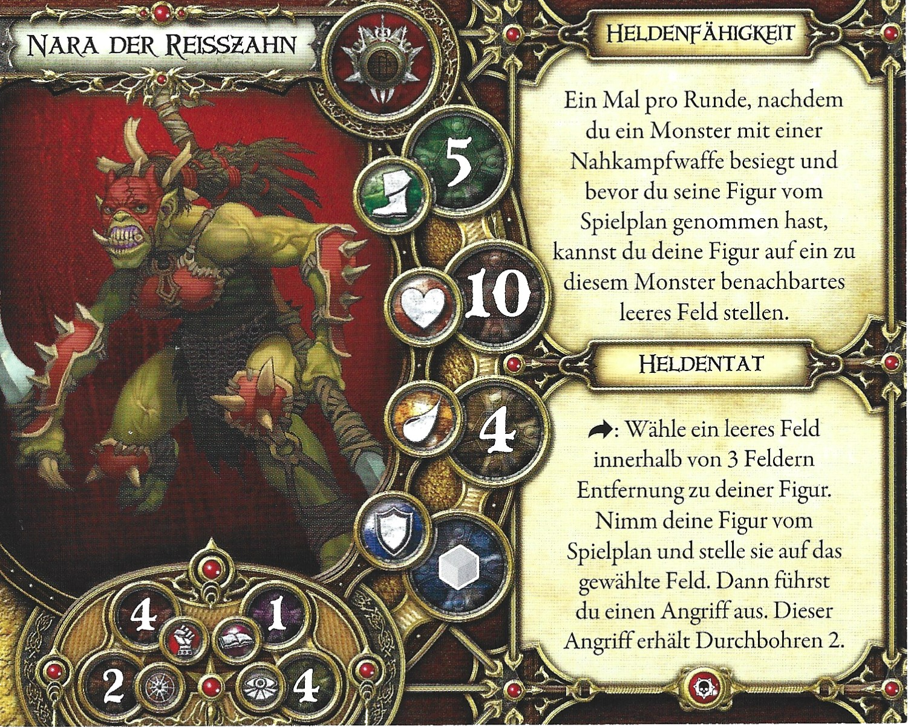

- **Archetyp:** Krieger
- **Erweiterung:** Prophezeiung eines neuen Anfangs
- **Gesundheit:** 10
- **Ausdauer:** 4
- **Geschwindigkeit:** 5
- **Verteidigung:** grau
- **Attribute:**
  - Stärke: 4
  - Willenskraft: 2
  - Wissen: 1
  - Gespür: 4

**Heldenfähigkeit:** Ein Mal pro Runde, nachdem du ein Monster mit einer Nahkampfwaffe besiegt und bevor du seine Figur vom Spielplan genommen hast, kannst du deine Figur auf ein zu diesem Monster benachbartes leeres Feld stellen.

**Heldentat:** [Aktion]: Wähle ein leeres Feld innerhalb von 3 Feldern Entfernung zu deiner Figur. Nimm deine Figur vom Spielplan und stelle sie auf das gewählte Feld. Dann führst du einen Angriff aus. Dieser Angriff erhält Durchbohren 2.

---

## Orkell der Flinke

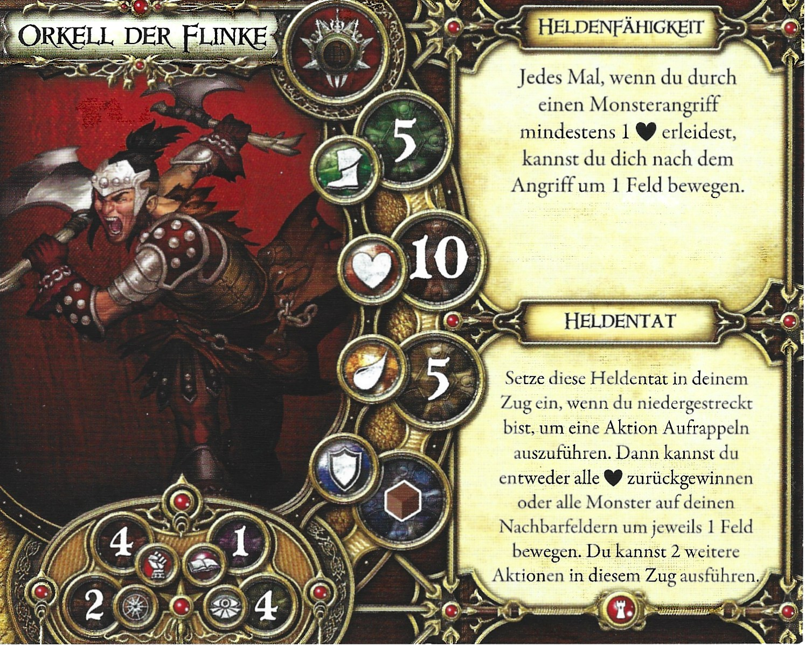

- **Archetyp:** Krieger
- **Erweiterung:** Schatten von Nerekhall
- **Gesundheit:** 10
- **Ausdauer:** 5
- **Geschwindigkeit:** 5
- **Verteidigung:** grau *(Scan nicht eindeutig; heroes.ts: braun)*
- **Attribute:**
  - Stärke: 4
  - Willenskraft: 2
  - Wissen: 1
  - Gespür: 4

**Heldenfähigkeit:** Jedes Mal, wenn du durch einen Monsterangriff mindestens 1 [Herz] erleidest, kannst du dich nach dem Angriff um 1 Feld bewegen.

**Heldentat:** Setze diese Heldentat in deinem Zug ein, wenn du niedergestreckt bist, um eine Aktion Aufrappeln auszuführen. Dann kannst du entweder alle [Herz] zurückgewinnen oder alle Monster auf deinen Nachbarfeldern um jeweils 1 Feld bewegen. Du kannst 2 weitere Aktionen in diesem Zug ausführen.

---

## Reynhart der Erhabene

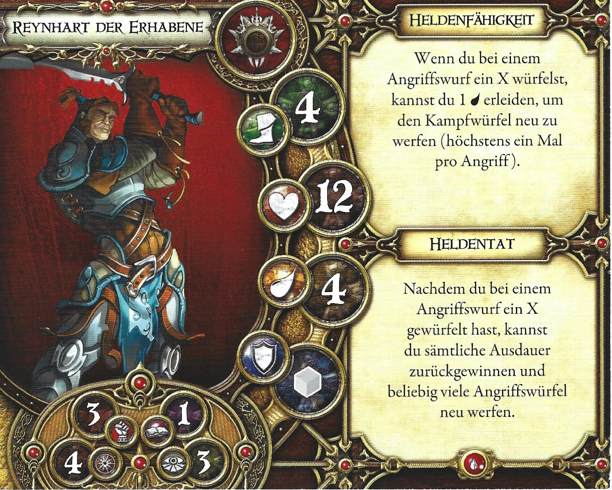

- **Archetyp:** Krieger
- **Erweiterung:** Die Höhle des Lindwurms
- **Gesundheit:** 12
- **Ausdauer:** 4
- **Geschwindigkeit:** 4
- **Verteidigung:** grau
- **Attribute:**
  - Stärke: 3
  - Willenskraft: 4
  - Wissen: 1
  - Gespür: 3

**Heldenfähigkeit:** Wenn du bei einem Angriffswurf ein X würfelst, kannst du 1 [Ausdauer] erleiden, um den Kampfwürfel neu zu werfen (höchstens ein Mal pro Angriff).

**Heldentat:** Nachdem du bei einem Angriffswurf ein X gewürfelt hast, kannst du sämtliche Ausdauer zurückgewinnen und beliebig viele Angriffswürfel neu werfen.

---

## Sir Valadir

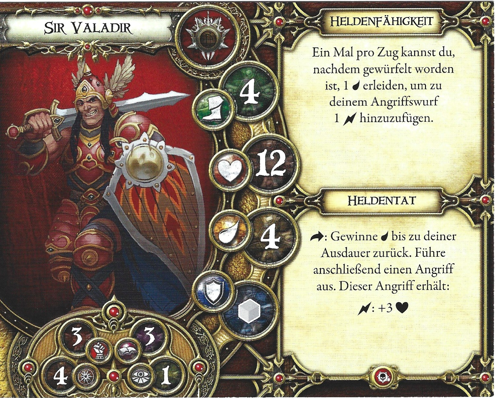

- **Archetyp:** Krieger
- **Erweiterung:** Prophezeiung eines neuen Anfangs
- **Gesundheit:** 12
- **Ausdauer:** 4
- **Geschwindigkeit:** 4
- **Verteidigung:** grau
- **Attribute:**
  - Stärke: 3
  - Willenskraft: 4
  - Wissen: 3
  - Gespür: 1

**Heldenfähigkeit:** Ein Mal pro Zug kannst du, nachdem gewürfelt worden ist, 1 [Ausdauer] erleiden, um zu deinem Angriffswurf 1 [Schub] hinzuzufügen.

**Heldentat:** [Aktion]: Gewinne [Ausdauer] bis zu deiner Ausdauer zurück. Führe anschließend einen Angriff aus. Dieser Angriff erhält: [Schub]: +3 [Herz]

---

## Stahlhorn

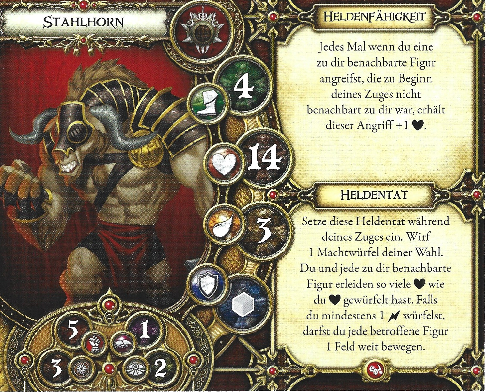

- **Archetyp:** Krieger
- **Erweiterung:** Scherben von Everdark
- **Gesundheit:** 14
- **Ausdauer:** 3
- **Geschwindigkeit:** 4
- **Verteidigung:** grau
- **Attribute:**
  - Stärke: 5
  - Willenskraft: 3
  - Wissen: 1
  - Gespür: 2

**Heldenfähigkeit:** Jedes Mal wenn du eine zu dir benachbarte Figur angreifst, die zu Beginn deines Zuges nicht benachbart zu dir war, erhält dieser Angriff +1 [Herz].

**Heldentat:** Setze diese Heldentat während deines Zuges ein. Wirf 1 Machtwürfel deiner Wahl. Du und jede zu dir benachbarte Figur erleiden so viele [Herz] wie du [Herz] gewürfelt hast. Falls du mindestens 1 [Schub] würfelst, darfst du jede betroffene Figur 1 Feld weit bewegen.

---

## Syndrael

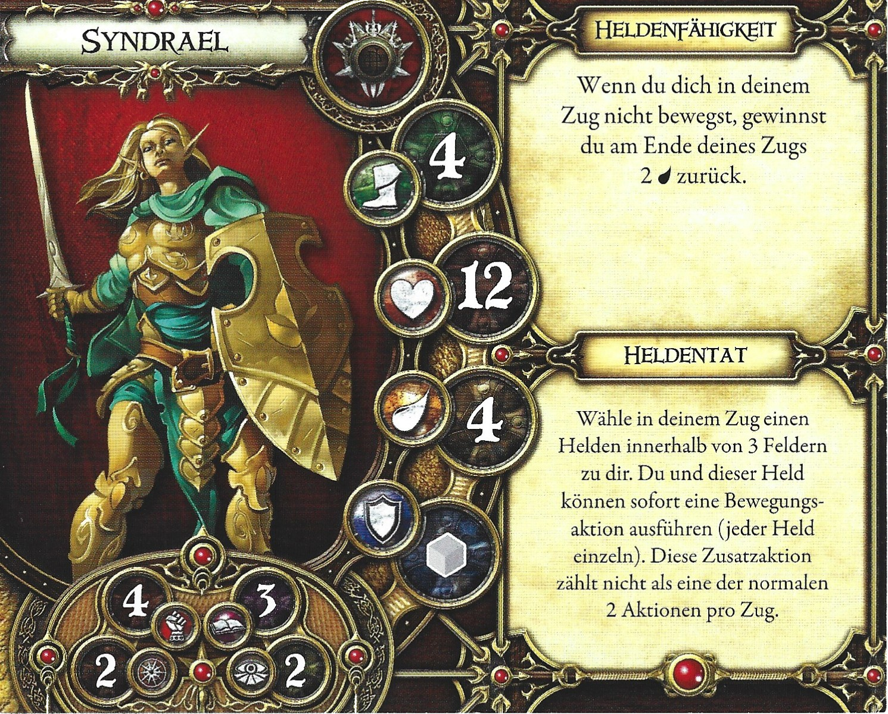

- **Archetyp:** Krieger
- **Erweiterung:** Grundspiel
- **Gesundheit:** 12
- **Ausdauer:** 4
- **Geschwindigkeit:** 4
- **Verteidigung:** grau
- **Attribute:**
  - Stärke: 4
  - Willenskraft: 2
  - Wissen: 3
  - Gespür: 2

**Heldenfähigkeit:** Wenn du dich in deinem Zug nicht bewegst, gewinnst du am Ende deines Zugs 2 [Ausdauer] zurück.

**Heldentat:** Wähle in deinem Zug einen Helden innerhalb von 3 Feldern zu dir. Du und dieser Held können sofort eine Bewegungsaktion ausführen (jeder Held einzeln). Diese Zusatzaktion zählt nicht als eine der normalen 2 Aktionen pro Zug.

---

## Tahlia

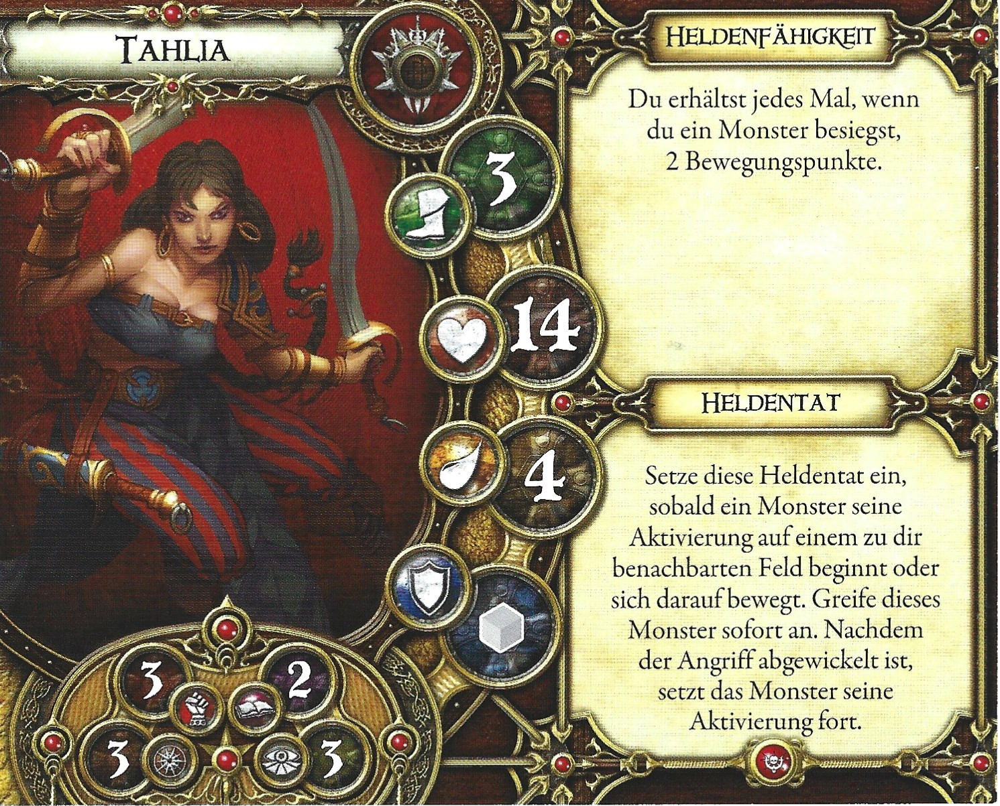

- **Archetyp:** Krieger
- **Erweiterung:** Kreuzzug der Vergessenen
- **Gesundheit:** 14
- **Ausdauer:** 4
- **Geschwindigkeit:** 3
- **Verteidigung:** grau
- **Attribute:**
  - Stärke: 3
  - Willenskraft: 3
  - Wissen: 2
  - Gespür: 3

**Heldenfähigkeit:** Du erhältst jedes Mal, wenn du ein Monster besiegst, 2 Bewegungspunkte.

**Heldentat:** Setze diese Heldentat ein, sobald ein Monster seine Aktivierung auf einem zu dir benachbarten Feld beginnt oder sich darauf bewegt. Greife dieses Monster sofort an. Nachdem der Angriff abgewickelt ist, setzt das Monster seine Aktivierung fort.

---

## Trenloe der Starke

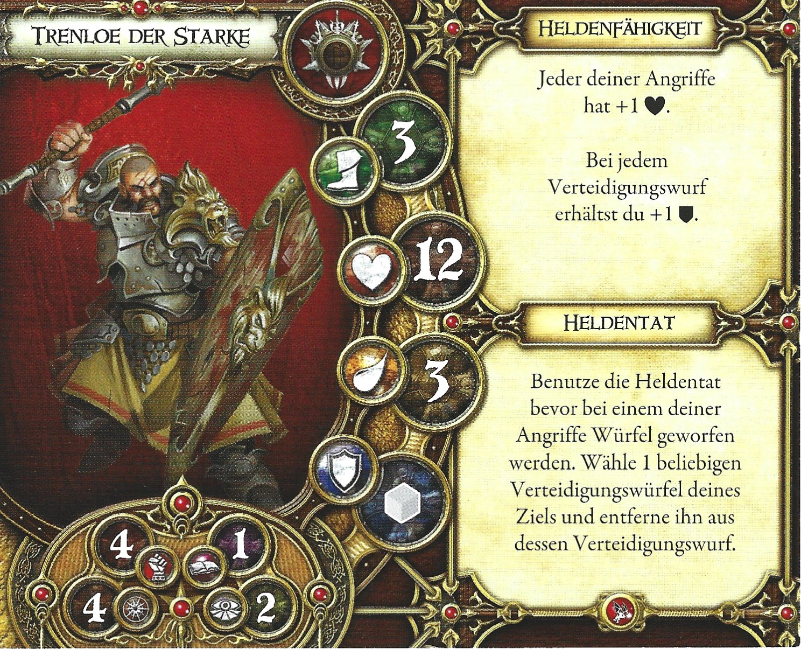

- **Archetyp:** Krieger
- **Erweiterung:** Schwur der Verbannten
- **Gesundheit:** 12
- **Ausdauer:** 3
- **Geschwindigkeit:** 3
- **Verteidigung:** grau
- **Attribute:**
  - Stärke: 4
  - Willenskraft: 4
  - Wissen: 1
  - Gespür: 2

**Heldenfähigkeit:** Jeder deiner Angriffe hat +1 [Herz]. Bei jedem Verteidigungswurf erhältst du +1 [Schild].

**Heldentat:** Benutze die Heldentat bevor bei einem deiner Angriffe Würfel geworfen werden. Wähle 1 beliebigen Verteidigungswürfel deines Ziels und entferne ihn aus dessen Verteidigungswurf.

---

