# Helden – Kundschafter

> Quelle: eingescannte **deutsche** Descent-2e-Heldenkarten. Werte und Texte wortgetreu von den Karten übernommen. Bilder: randlos freigestellt (transparenter Hintergrund), volle Auflösung.
>
> **Symbol-Legende:** `[Herz]` Gesundheit/Schaden · `[Ausdauer]` Ausdauer/Erschöpfung · `[Schub]` Schub · `[Schild]` Schild · `[Aktion]` Aktion (Aktions-Pfeil) · `[Bewegung]` Bewegung · `[Stärke]`/`[Willenskraft]`/`[Wissen]`/`[Gespür]` Attributsproben.
>
> **Hinweis:** Inline-Symbole wurden maschinell aus den Scans gelesen; der Fließtext ist wortgetreu. Vereinzelte Symbol-Platzhalter (v. a. `[Schild]`/`[Schub]`) bitte beim Review gegen die Karte prüfen.

---

## Arvel Weltenwanderer

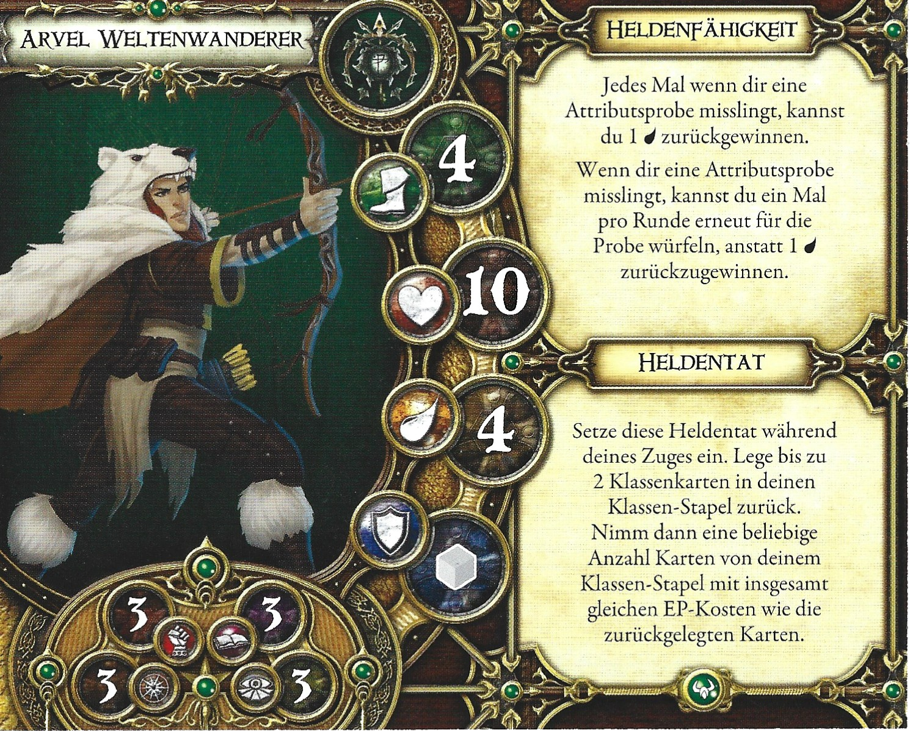

- **Archetyp:** Kundschafter
- **Erweiterung:** Scherben von Everdark
- **Gesundheit:** 10
- **Ausdauer:** 4
- **Geschwindigkeit:** 4
- **Verteidigung:** grau
- **Attribute:**
  - Stärke: 3
  - Willenskraft: 3
  - Wissen: 3
  - Gespür: 3

**Heldenfähigkeit:** Jedes Mal wenn dir eine Attributsprobe misslingt, kannst du 1 [Ausdauer] zurückgewinnen. Wenn dir eine Attributsprobe misslingt, kannst du ein Mal pro Runde erneut für die Probe würfeln, anstatt 1 [Ausdauer] zurückzugewinnen.

**Heldentat:** Setze diese Heldentat während deines Zuges ein. Lege bis zu 2 Klassenkarten in deinen Klassen-Stapel zurück. Nimm dann eine beliebige Anzahl Karten von deinem Klassen-Stapel mit insgesamt gleichen EP-Kosten wie die zurückgelegten Karten.

---

## Jaine Fairwood

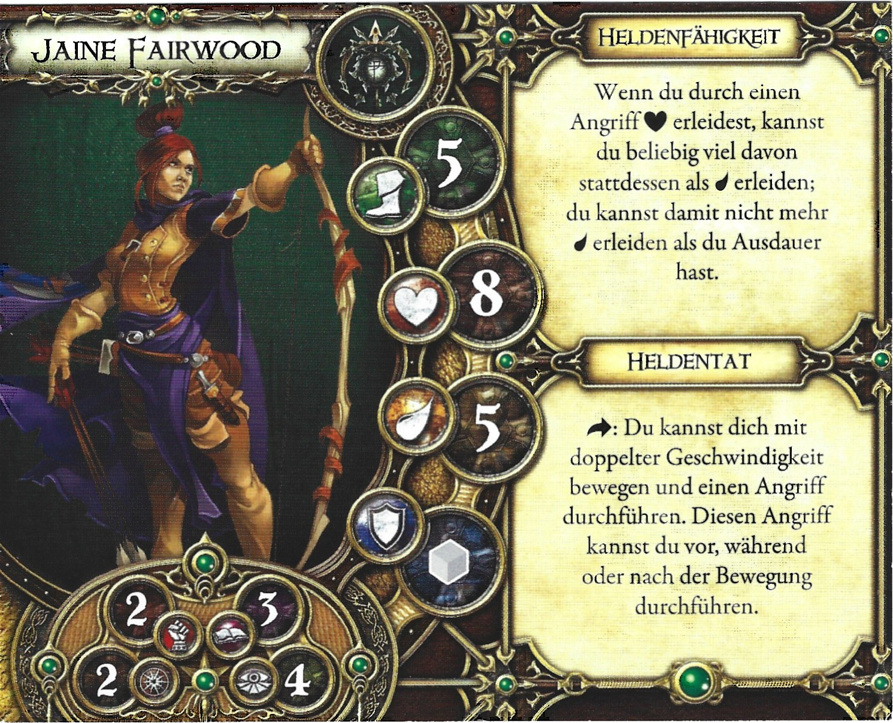

- **Archetyp:** Kundschafter
- **Erweiterung:** Grundspiel
- **Gesundheit:** 8
- **Ausdauer:** 5
- **Geschwindigkeit:** 5
- **Verteidigung:** grau
- **Attribute:**
  - Stärke: 2
  - Willenskraft: 2
  - Wissen: 3
  - Gespür: 4

**Heldenfähigkeit:** Wenn du durch einen Angriff [Herz] erleidest, kannst du beliebig viel davon stattdessen als [Ausdauer] erleiden; du kannst damit nicht mehr [Ausdauer] erleiden als du Ausdauer hast.

**Heldentat:** [Aktion]: Du kannst dich mit doppelter Geschwindigkeit bewegen und einen Angriff durchführen. Diesen Angriff kannst du vor, während oder nach der Bewegung durchführen.

---

## Ker der Graue

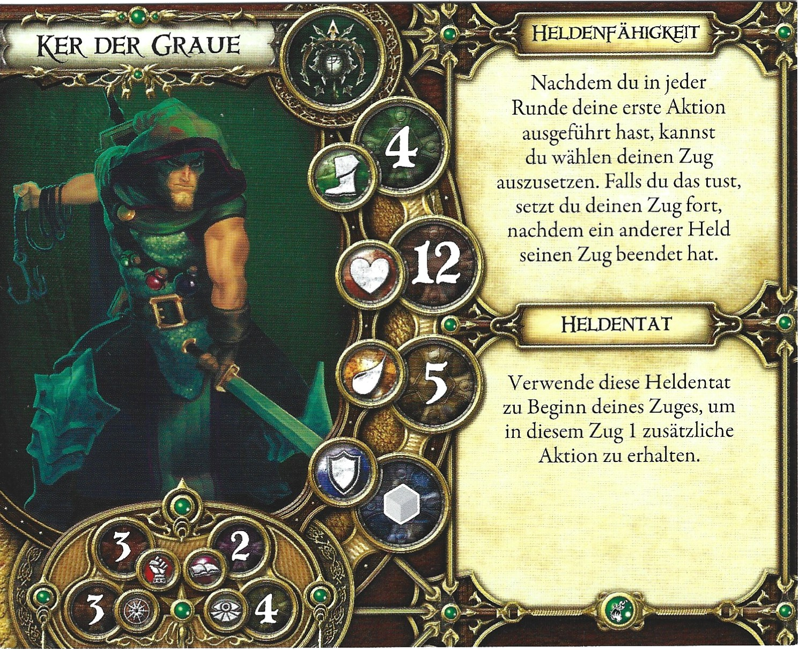

- **Archetyp:** Kundschafter
- **Erweiterung:** Kontrakt der Unbesiegten
- **Gesundheit:** 12
- **Ausdauer:** 5
- **Geschwindigkeit:** 4
- **Verteidigung:** grau
- **Attribute:**
  - Stärke: 3
  - Willenskraft: 3
  - Wissen: 2
  - Gespür: 4

**Heldenfähigkeit:** Nachdem du in jeder Runde deine erste Aktion ausgeführt hast, kannst du wählen deinen Zug auszusetzen. Falls du das tust, setzt du deinen Zug fort, nachdem ein anderer Held seinen Zug beendet hat.

**Heldentat:** Verwende diese Heldentat zu Beginn deines Zuges, um in diesem Zug 1 zusätzliche Aktion zu erhalten.

---

## Laurel vom Blutwald

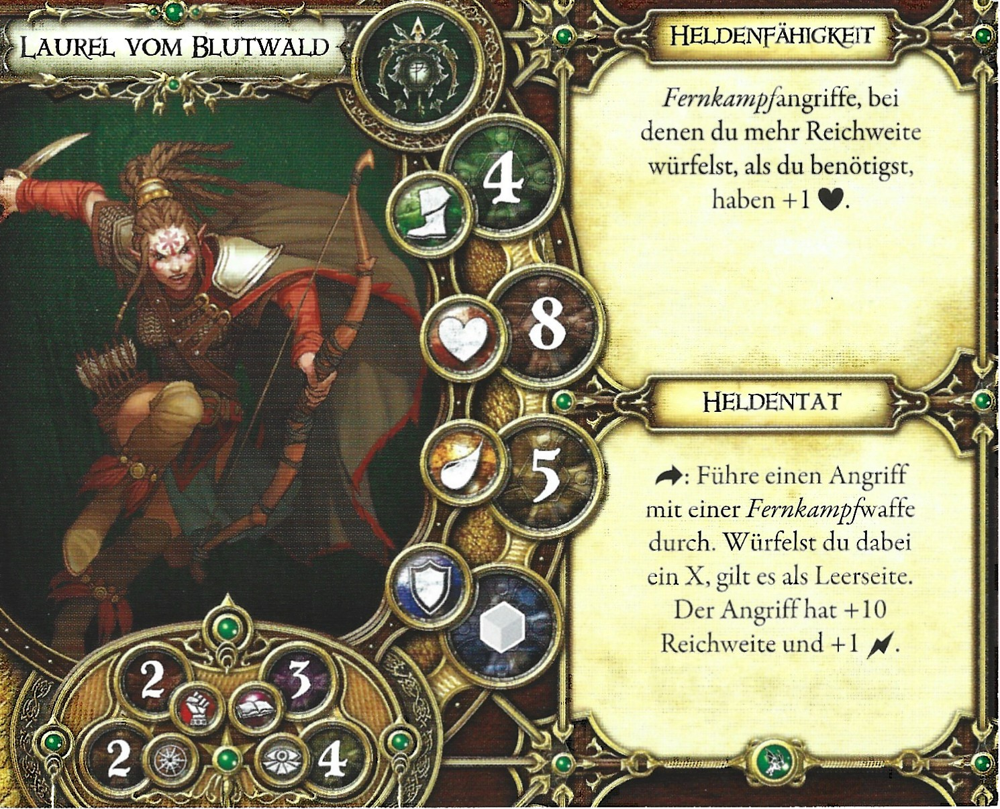

- **Archetyp:** Kundschafter
- **Erweiterung:** Schwur der Verbannten
- **Gesundheit:** 8
- **Ausdauer:** 5
- **Geschwindigkeit:** 4
- **Verteidigung:** grau
- **Attribute:**
  - Stärke: 2
  - Willenskraft: 2
  - Wissen: 3
  - Gespür: 4

**Heldenfähigkeit:** Fernkampfangriffe, bei denen du mehr Reichweite würfelst, als du benötigst, haben +1 [Herz].

**Heldentat:** [Aktion]: Führe einen Angriff mit einer Fernkampfwaffe durch. Würfelst du dabei ein X, gilt es als Leerseite. Der Angriff hat +10 Reichweite und +1 [Bewegung].

---

## Lindel

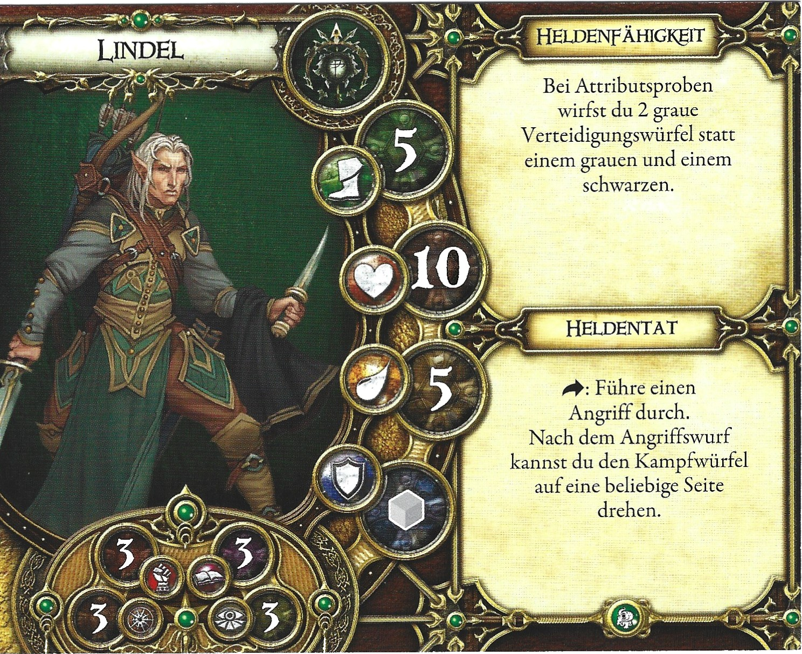

- **Archetyp:** Kundschafter
- **Erweiterung:** Krone des Schicksals
- **Gesundheit:** 10
- **Ausdauer:** 5
- **Geschwindigkeit:** 5
- **Verteidigung:** grau
- **Attribute:**
  - Stärke: 3
  - Willenskraft: 3
  - Wissen: 3
  - Gespür: 3

**Heldenfähigkeit:** Bei Attributsproben wirfst du 2 graue Verteidigungswürfel statt einem grauen und einem schwarzen.

**Heldentat:** [Aktion]: Führe einen Angriff durch. Nach dem Angriffswurf kannst du den Kampfwürfel auf eine beliebige Seite drehen.

---

## Logan Lashley

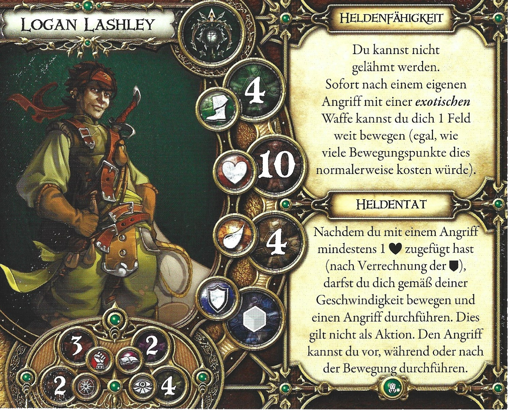

- **Archetyp:** Kundschafter
- **Erweiterung:** Labyrinth des Verderbens
- **Gesundheit:** 10
- **Ausdauer:** 4
- **Geschwindigkeit:** 4
- **Verteidigung:** grau
- **Attribute:**
  - Stärke: 3
  - Willenskraft: 2
  - Wissen: 2
  - Gespür: 4

**Heldenfähigkeit:** Du kannst nicht gelähmt werden. Sofort nach einem eigenen Angriff mit einer exotischen Waffe kannst du dich 1 Feld weit bewegen (egal, wie viele Bewegungspunkte dies normalerweise kosten würde).

**Heldentat:** Nachdem du mit einem Angriff mindestens 1 [Herz] zugefügt hast (nach Verrechnung der [Ausdauer]), darfst du dich gemäß deiner Geschwindigkeit bewegen und einen Angriff durchführen. Dies gilt nicht als Aktion. Den Angriff kannst du vor, während oder nach der Bewegung durchführen.

---

## Roganna der Schemen

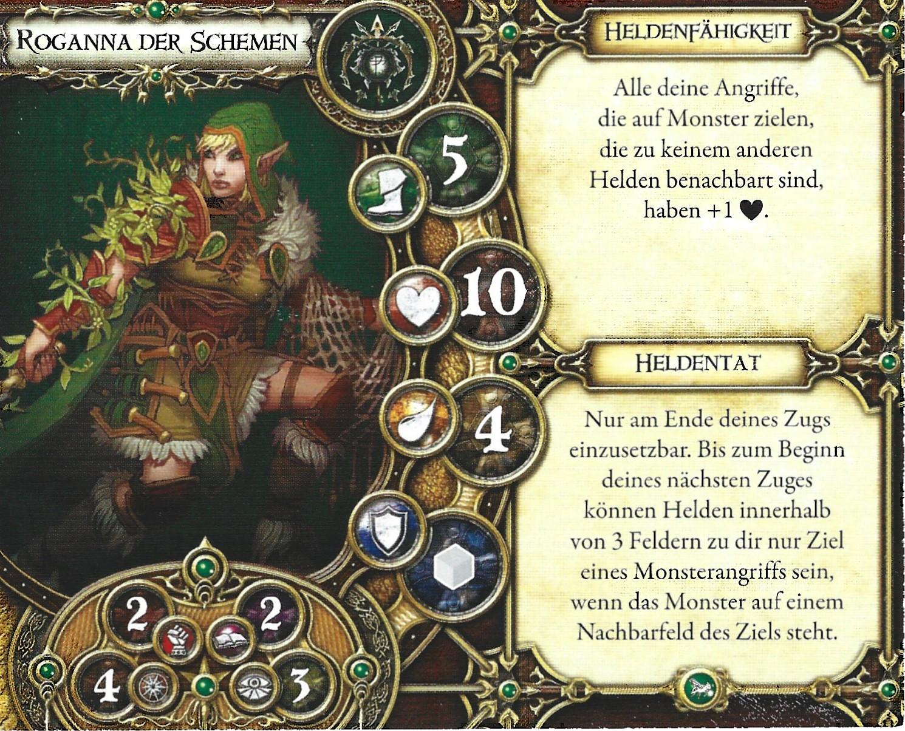

- **Archetyp:** Kundschafter
- **Erweiterung:** Die Trollsümpfe
- **Gesundheit:** 10
- **Ausdauer:** 4
- **Geschwindigkeit:** 5
- **Verteidigung:** grau
- **Attribute:**
  - Stärke: 2
  - Willenskraft: 4
  - Wissen: 2
  - Gespür: 3

**Heldenfähigkeit:** Alle deine Angriffe, die auf Monster zielen, die zu keinem anderen Helden benachbart sind, haben +1 [Herz].

**Heldentat:** Nur am Ende deines Zugs einzusetzbar. Bis zum Beginn deines nächsten Zuges können Helden innerhalb von 3 Feldern zu dir nur Ziel eines Monsterangriffs sein, wenn das Monster auf einem Nachbarfeld des Ziels steht.

---

## Silhouette

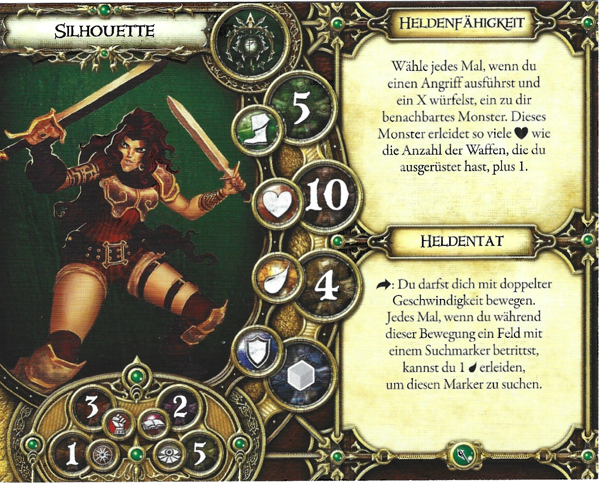

- **Archetyp:** Kundschafter
- **Erweiterung:** Wächter von Deephall
- **Gesundheit:** 10
- **Ausdauer:** 4
- **Geschwindigkeit:** 5
- **Verteidigung:** grau
- **Attribute:**
  - Stärke: 3
  - Willenskraft: 1
  - Wissen: 2
  - Gespür: 5

**Heldenfähigkeit:** Wähle jedes Mal, wenn du einen Angriff ausführst und ein X würfelst, ein zu dir benachbartes Monster. Dieses Monster erleidet so viele [Herz] wie die Anzahl der Waffen, die du ausgerüstet hast, plus 1.

**Heldentat:** [Aktion]: Du darfst dich mit doppelter Geschwindigkeit bewegen. Jedes Mal, wenn du während dieser Bewegung ein Feld mit einem Suchmarker betrittst, kannst du 1 [Herz] erleiden, um diesen Marker zu suchen.

---

## Tatianna

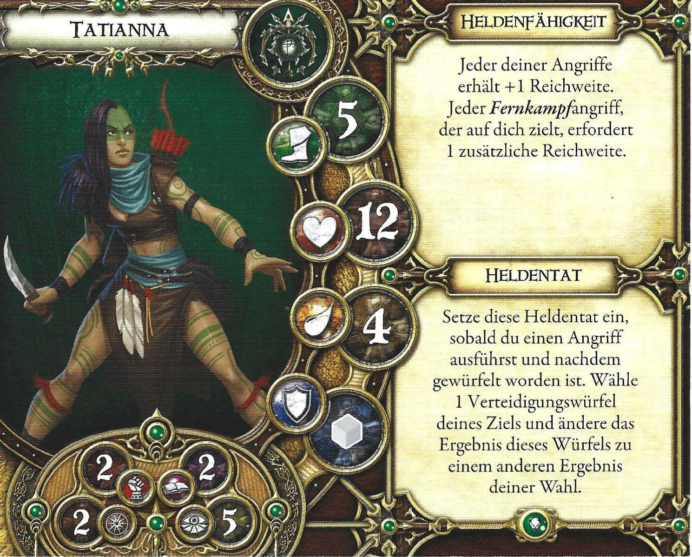

- **Archetyp:** Kundschafter
- **Erweiterung:** Hüter des Geheimnisses
- **Gesundheit:** 12
- **Ausdauer:** 4
- **Geschwindigkeit:** 5
- **Verteidigung:** grau
- **Attribute:**
  - Stärke: 2
  - Willenskraft: 2
  - Wissen: 2
  - Gespür: 5

**Heldenfähigkeit:** Jeder deiner Angriffe erhält +1 Reichweite. Jeder Fernkampfangriff, der auf dich zielt, erfordert 1 zusätzliche Reichweite.

**Heldentat:** Setze diese Heldentat ein, sobald du einen Angriff ausführst und nachdem gewürfelt worden ist. Wähle 1 Verteidigungswürfel deines Ziels und ändere das Ergebnis dieses Würfels zu einem anderen Ergebnis deiner Wahl.

---

## Tetherys

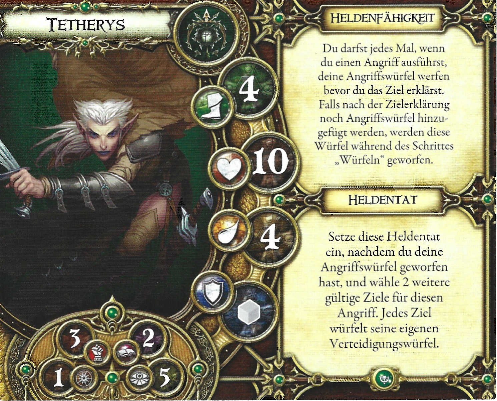

- **Archetyp:** Kundschafter
- **Erweiterung:** Kreuzzug der Vergessenen
- **Gesundheit:** 10
- **Ausdauer:** 4
- **Geschwindigkeit:** 4
- **Verteidigung:** grau
- **Attribute:**
  - Stärke: 3
  - Willenskraft: 1
  - Wissen: 2
  - Gespür: 5

**Heldenfähigkeit:** Du darfst jedes Mal, wenn du einen Angriff ausführst, deine Angriffswürfel werfen bevor du das Ziel erklärst. Falls nach der Zielerklärung noch Angriffswürfel hinzugefügt werden, werden diese Würfel während des Schrittes „Würfeln" geworfen.

**Heldentat:** Setze diese Heldentat ein, nachdem du deine Angriffswürfel geworfen hast, und wähle 2 weitere gültige Ziele für diesen Angriff. Jedes Ziel würfelt seine eigenen Verteidigungswürfel.

---

## Thaiden Nebelspitze

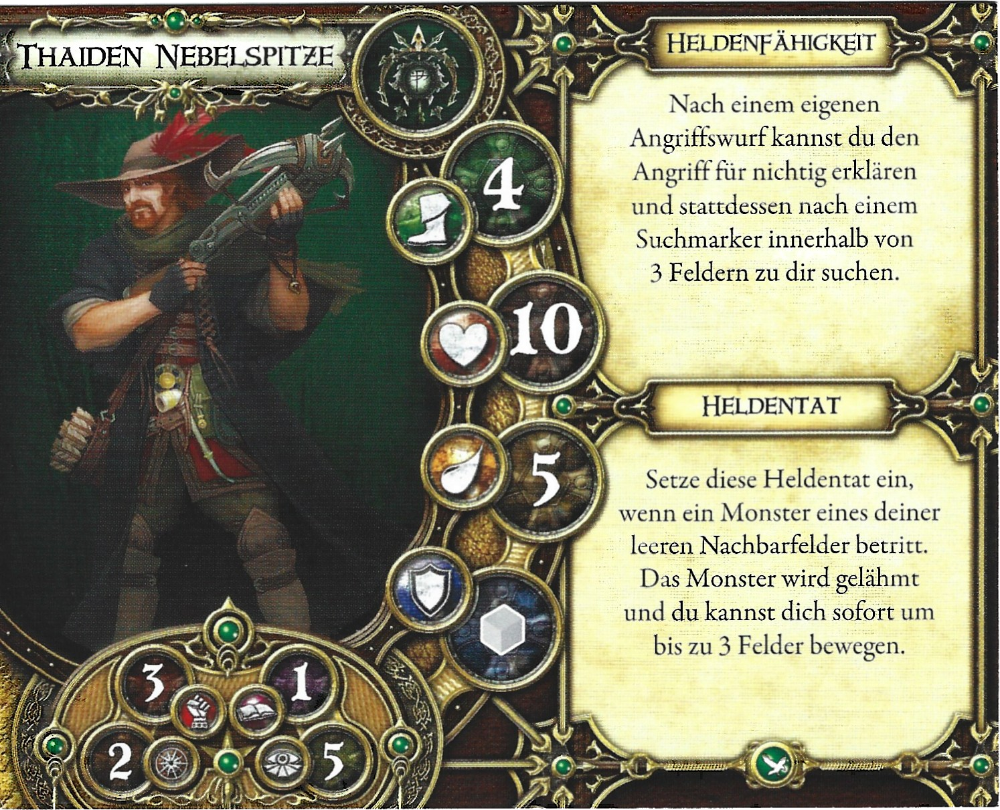

- **Archetyp:** Kundschafter
- **Erweiterung:** Schloss Rabenfels
- **Gesundheit:** 10
- **Ausdauer:** 5
- **Geschwindigkeit:** 4
- **Verteidigung:** grau
- **Attribute:**
  - Stärke: 3
  - Willenskraft: 2
  - Wissen: 1
  - Gespür: 5

**Heldenfähigkeit:** Nach einem eigenen Angriffswurf kannst du den Angriff für nichtig erklären und stattdessen nach einem Suchmarker innerhalb von 3 Feldern zu dir suchen.

**Heldentat:** Setze diese Heldentat ein, wenn ein Monster eines deiner leeren Nachbarfelder betritt. Das Monster wird gelähmt und du kannst dich sofort um bis zu 3 Felder bewegen.

---

## Tinashi die Wanderin

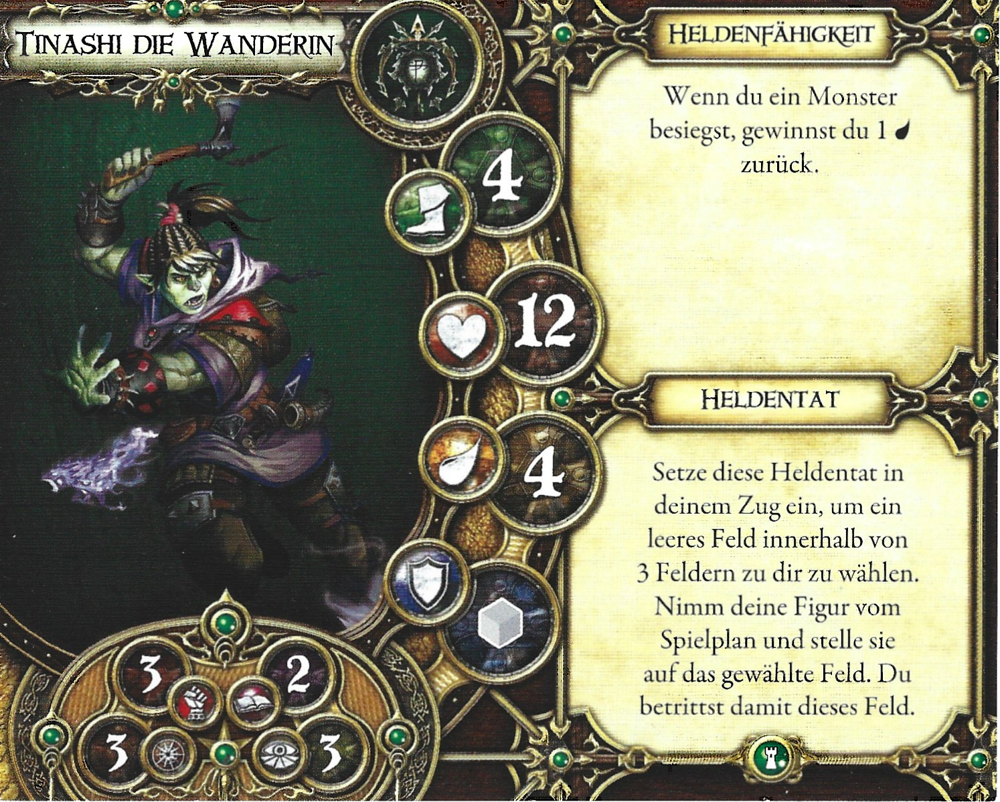

- **Archetyp:** Kundschafter
- **Erweiterung:** Schatten von Nerekhall
- **Gesundheit:** 12
- **Ausdauer:** 4
- **Geschwindigkeit:** 4
- **Verteidigung:** grau
- **Attribute:**
  - Stärke: 3
  - Willenskraft: 3
  - Wissen: 2
  - Gespür: 3

**Heldenfähigkeit:** Wenn du ein Monster besiegst, gewinnst du 1 [Ausdauer] zurück.

**Heldentat:** Setze diese Heldentat in deinem Zug ein, um ein leeres Feld innerhalb von 3 Feldern zu dir zu wählen. Nimm deine Figur vom Spielplan und stelle sie auf das gewählte Feld. Du betrittst damit dieses Feld.

---

## Tomble Burrowell

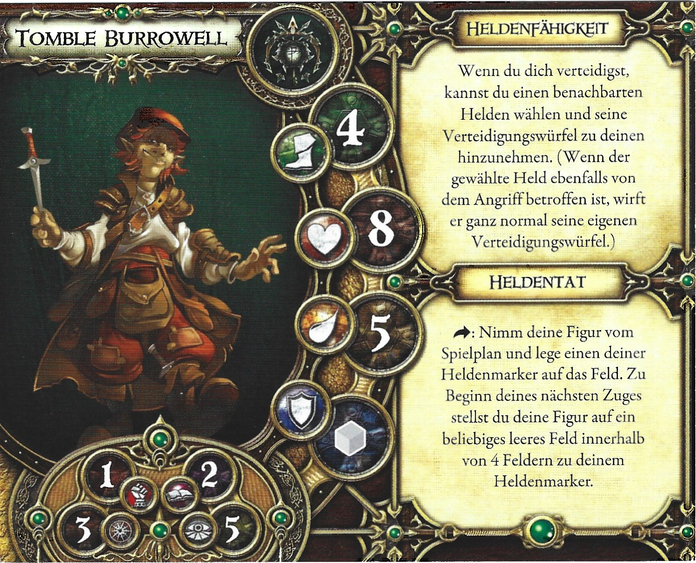

- **Archetyp:** Kundschafter
- **Erweiterung:** Grundspiel
- **Gesundheit:** 8
- **Ausdauer:** 5
- **Geschwindigkeit:** 4
- **Verteidigung:** grau
- **Attribute:**
  - Stärke: 1
  - Willenskraft: 3
  - Wissen: 2
  - Gespür: 5

**Heldenfähigkeit:** Wenn du dich verteidigst, kannst du einen benachbarten Helden wählen und seine Verteidigungswürfel zu deinen hinzunehmen. (Wenn der gewählte Held ebenfalls von dem Angriff betroffen ist, wirft er ganz normal seine eigenen Verteidigungswürfel.)

**Heldentat:** [Aktion]: Nimm deine Figur vom Spielplan und lege einen deiner Heldenmarker auf das Feld. Zu Beginn deines nächsten Zuges stellst du deine Figur auf ein beliebiges leeres Feld innerhalb von 4 Feldern zu deinem Heldenmarker.

---

