# Helden – Magier

> Quelle: eingescannte **deutsche** Descent-2e-Heldenkarten. Werte und Texte wortgetreu von den Karten übernommen. Bilder: randlos freigestellt (transparenter Hintergrund), volle Auflösung.
>
> **Symbol-Legende:** `[Herz]` Gesundheit/Schaden · `[Ausdauer]` Ausdauer/Erschöpfung · `[Schub]` Schub · `[Schild]` Schild · `[Aktion]` Aktion (Aktions-Pfeil) · `[Bewegung]` Bewegung · `[Stärke]`/`[Willenskraft]`/`[Wissen]`/`[Gespür]` Attributsproben.
>
> **Hinweis:** Inline-Symbole wurden maschinell aus den Scans gelesen; der Fließtext ist wortgetreu. Vereinzelte Symbol-Platzhalter (v. a. `[Schild]`/`[Schub]`) bitte beim Review gegen die Karte prüfen.

---

## Astarra

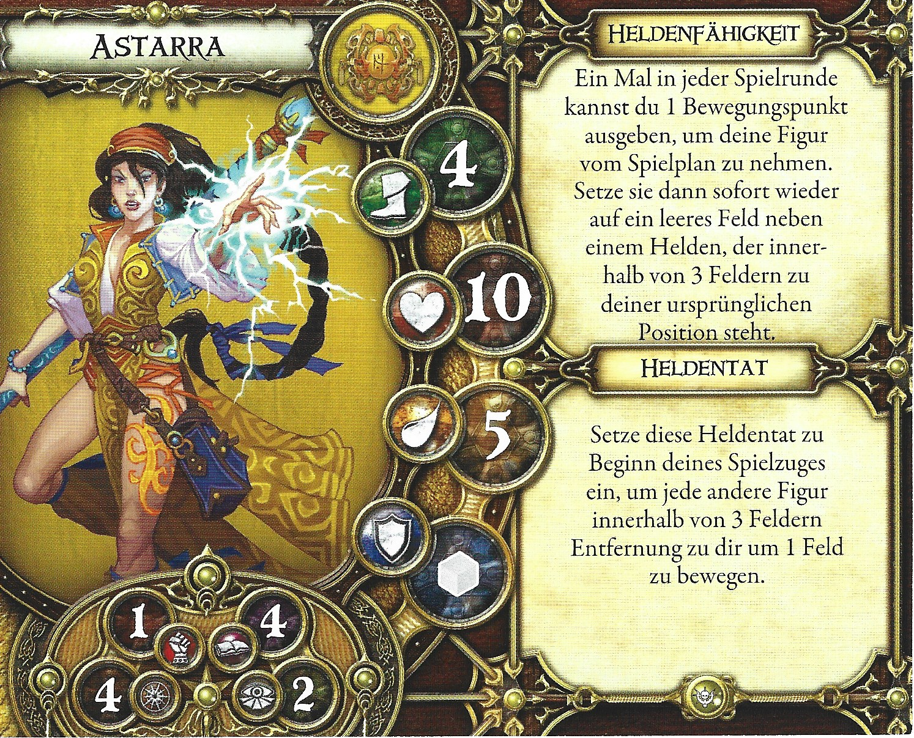

- **Archetyp:** Magier
- **Erweiterung:** Kreuzzug der Vergessenen
- **Gesundheit:** 10
- **Ausdauer:** 5
- **Geschwindigkeit:** 4
- **Verteidigung:** grau
- **Attribute:**
  - Stärke: 1
  - Willenskraft: 4
  - Wissen: 4
  - Gespür: 2

**Heldenfähigkeit:** Ein Mal in jeder Spielrunde kannst du 1 Bewegungspunkt ausgeben, um deine Figur vom Spielplan zu nehmen. Setze sie dann sofort wieder auf ein leeres Feld neben einem Helden, der innerhalb von 3 Feldern zu deiner ursprünglichen Position steht.

**Heldentat:** Setze diese Heldentat zu Beginn deines Spielzuges ein, um jede andere Figur innerhalb von 3 Feldern Entfernung zu dir um 1 Feld zu bewegen.

---

## Desra die Schändliche

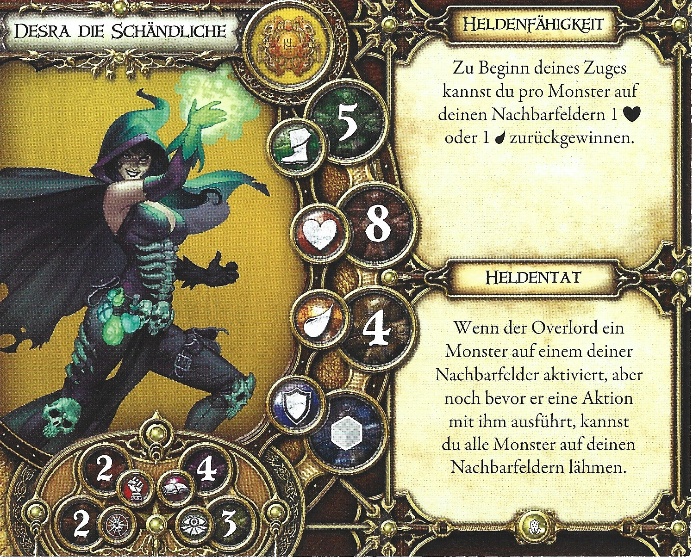

- **Archetyp:** Magier
- **Erweiterung:** Labyrinth des Verderbens
- **Gesundheit:** 8
- **Ausdauer:** 4
- **Geschwindigkeit:** 5
- **Verteidigung:** grau
- **Attribute:**
  - Stärke: 2
  - Willenskraft: 2
  - Wissen: 4
  - Gespür: 3

**Heldenfähigkeit:** Zu Beginn deines Zuges kannst du pro Monster auf deinen Nachbarfeldern 1 [Herz] oder 1 [Ausdauer] zurückgewinnen.

**Heldentat:** Wenn der Overlord ein Monster auf einem deiner Nachbarfelder aktiviert, aber noch bevor er eine Aktion mit ihm ausführt, kannst du alle Monster auf deinen Nachbarfeldern lähmen.

---

## Großmagier Cwellin

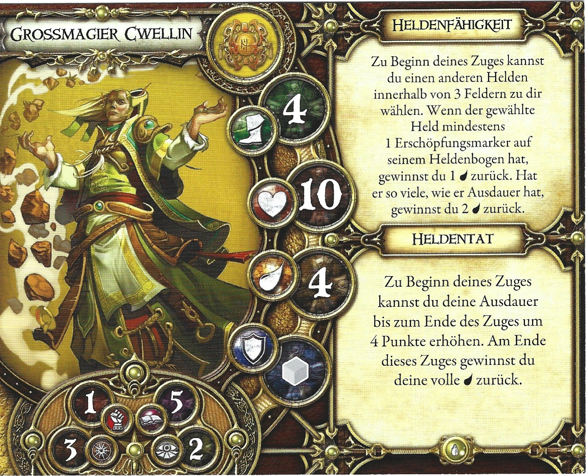

- **Archetyp:** Magier
- **Erweiterung:** Die Höhle des Lindwurms
- **Gesundheit:** 10
- **Ausdauer:** 4
- **Geschwindigkeit:** 4
- **Verteidigung:** grau
- **Attribute:**
  - Stärke: 1
  - Willenskraft: 3
  - Wissen: 5
  - Gespür: 2

**Heldenfähigkeit:** Zu Beginn deines Zuges kannst du einen anderen Helden innerhalb von 3 Feldern zu dir wählen. Wenn der gewählte Held mindestens 1 Erschöpfungsmarker auf seinem Heldenbogen hat, gewinnst du 1 [Ausdauer] zurück. Hat er so viele, wie er Ausdauer hat, gewinnst du 2 [Ausdauer] zurück.

**Heldentat:** Zu Beginn deines Zuges kannst du deine Ausdauer bis zum Ende des Zuges um 4 Punkte erhöhen. Am Ende dieses Zuges gewinnst du deine volle [Ausdauer] zurück.

---

## Jaes der Verbannte

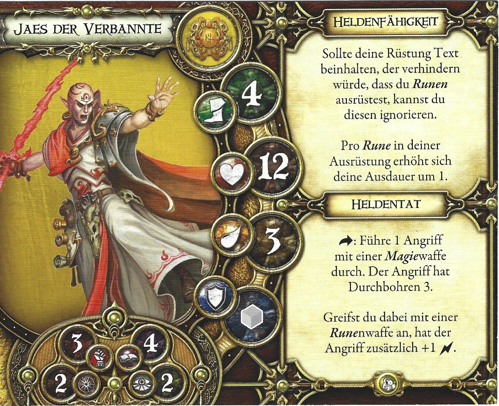

- **Archetyp:** Magier
- **Erweiterung:** Krone des Schicksals
- **Gesundheit:** 12
- **Ausdauer:** 3
- **Geschwindigkeit:** 4
- **Verteidigung:** grau
- **Attribute:**
  - Stärke: 3
  - Willenskraft: 2
  - Wissen: 4
  - Gespür: 2

**Heldenfähigkeit:** Sollte deine Rüstung Text beinhalten, der verhindern würde, dass du Runen ausrüstest, kannst du diesen ignorieren. Pro Rune in deiner Ausrüstung erhöht sich deine Ausdauer um 1.

**Heldentat:** [Aktion]: Führe 1 Angriff mit einer Magiewaffe durch. Der Angriff hat Durchbohren 3. Greifst du dabei mit einer Runenwaffe an, hat der Angriff zusätzlich +1 [Herz].

---

## Leorik der Gelehrte

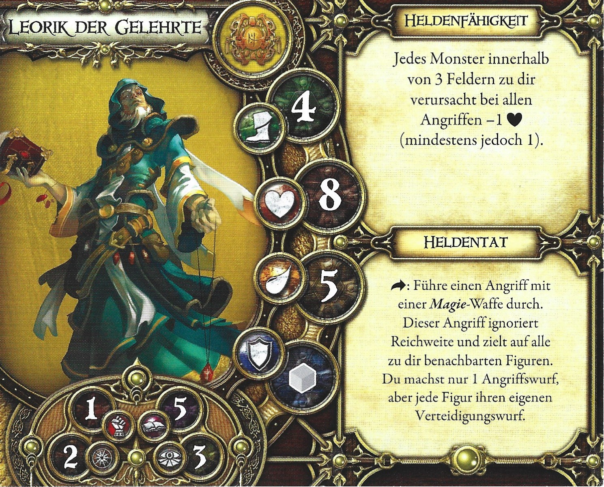

- **Archetyp:** Magier
- **Erweiterung:** Grundspiel
- **Gesundheit:** 8
- **Ausdauer:** 5
- **Geschwindigkeit:** 4
- **Verteidigung:** grau
- **Attribute:**
  - Stärke: 1
  - Willenskraft: 2
  - Wissen: 5
  - Gespür: 3

**Heldenfähigkeit:** Jedes Monster innerhalb von 3 Feldern zu dir verursacht bei allen Angriffen -1 [Herz] (mindestens jedoch 1).

**Heldentat:** [Aktion]: Führe einen Angriff mit einer Magie-Waffe durch. Dieser Angriff ignoriert Reichweite und zielt auf alle zu dir benachbarten Figuren. Du machst nur 1 Angriffswurf, aber jede Figur ihren eigenen Verteidigungswurf.

---

## Meister Thorn

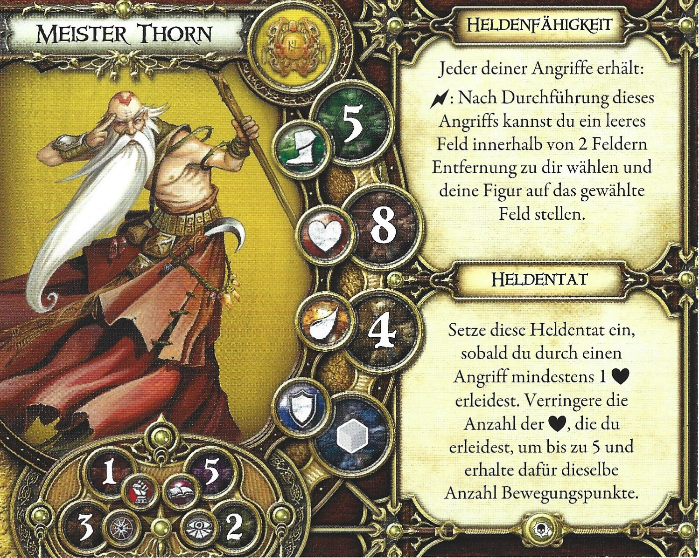

- **Archetyp:** Magier
- **Erweiterung:** Prophezeiung eines neuen Anfangs
- **Gesundheit:** 8
- **Ausdauer:** 4
- **Geschwindigkeit:** 5
- **Verteidigung:** grau
- **Attribute:**
  - Stärke: 1
  - Willenskraft: 3
  - Wissen: 5
  - Gespür: 2

**Heldenfähigkeit:** Jeder deiner Angriffe erhält: [Schub]: Nach Durchführung dieses Angriffs kannst du ein leeres Feld innerhalb von 2 Feldern Entfernung zu dir wählen und deine Figur auf das gewählte Feld stellen.

**Heldentat:** Setze diese Heldentat ein, sobald du durch einen Angriff mindestens 1 [Herz] erleidest. Verringere die Anzahl der [Herz], die du erleidest, um bis zu 5 und erhalte dafür dieselbe Anzahl Bewegungspunkte.

---

## Ravaella Leichtfuß

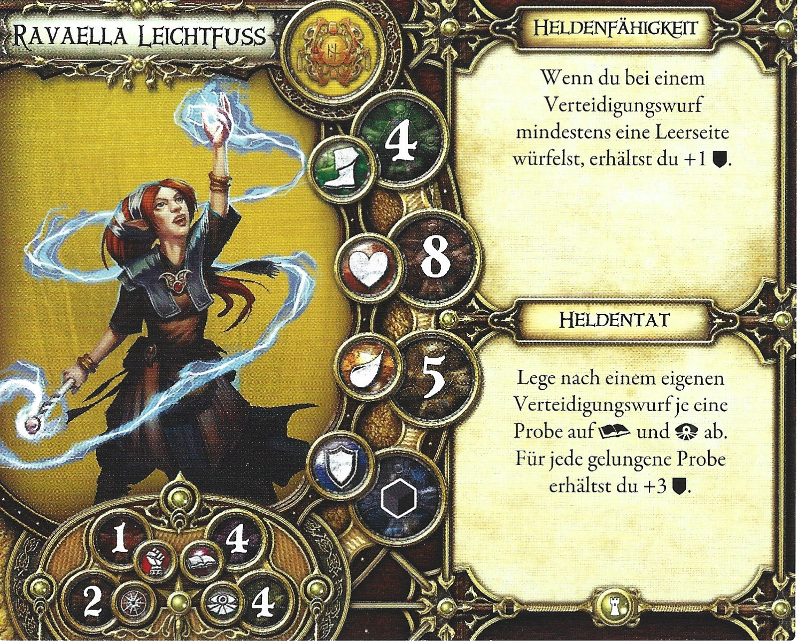

- **Archetyp:** Magier
- **Erweiterung:** Schatten von Nerekhall
- **Gesundheit:** 8
- **Ausdauer:** 5
- **Geschwindigkeit:** 4
- **Verteidigung:** grau *(Scan nicht eindeutig; heroes.ts: schwarz)*
- **Attribute:**
  - Stärke: 1
  - Willenskraft: 2
  - Wissen: 4
  - Gespür: 4

**Heldenfähigkeit:** Wenn du bei einem Verteidigungswurf mindestens eine Leerseite würfelst, erhältst du +1 [Schild].

**Heldentat:** Lege nach einem eigenen Verteidigungswurf je eine Probe auf [Willenskraft] und [Wissen] ab. Für jede gelungene Probe erhältst du +3 [Schild].

---

## Seherin Kel

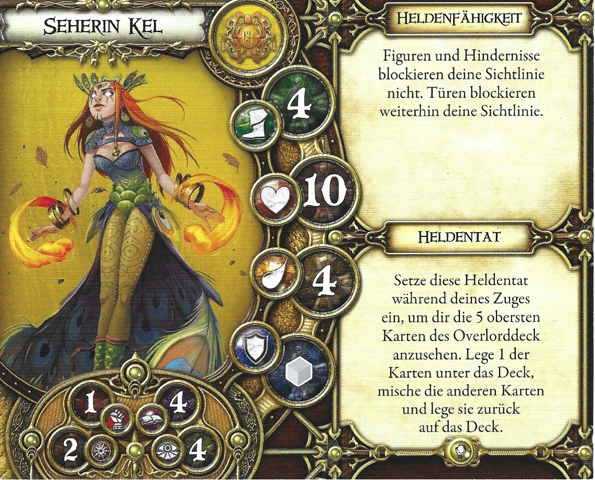

- **Archetyp:** Magier
- **Erweiterung:** Hüter des Geheimnisses
- **Gesundheit:** 10
- **Ausdauer:** 4
- **Geschwindigkeit:** 4
- **Verteidigung:** grau
- **Attribute:**
  - Stärke: 1
  - Willenskraft: 2
  - Wissen: 4
  - Gespür: 4

**Heldenfähigkeit:** Figuren und Hindernisse blockieren deine Sichtlinie nicht. Türen blockieren weiterhin deine Sichtlinie.

**Heldentat:** Setze diese Heldentat während deines Zuges ein, um dir die 5 obersten Karten des Overlorddeck anzusehen. Lege 1 der Karten unter das Deck, mische die anderen Karten und lege sie zurück auf das Deck.

---

## Shiver

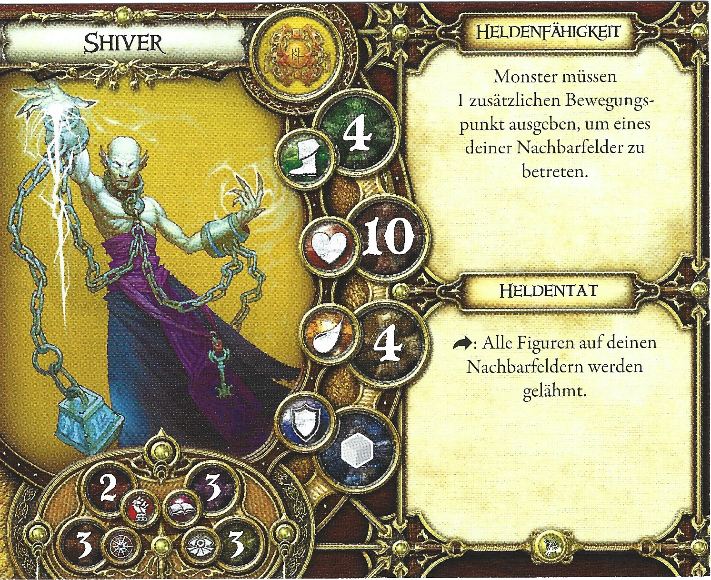

- **Archetyp:** Magier
- **Erweiterung:** Schwur der Verbannten
- **Gesundheit:** 10
- **Ausdauer:** 4
- **Geschwindigkeit:** 4
- **Verteidigung:** grau
- **Attribute:**
  - Stärke: 2
  - Willenskraft: 3
  - Wissen: 3
  - Gespür: 3

**Heldenfähigkeit:** Monster müssen 1 zusätzlichen Bewegungspunkt ausgeben, um eines deiner Nachbarfelder zu betreten.

**Heldentat:** [Aktion]: Alle Figuren auf deinen Nachbarfeldern werden gelähmt.

---

## Witwe Tarha

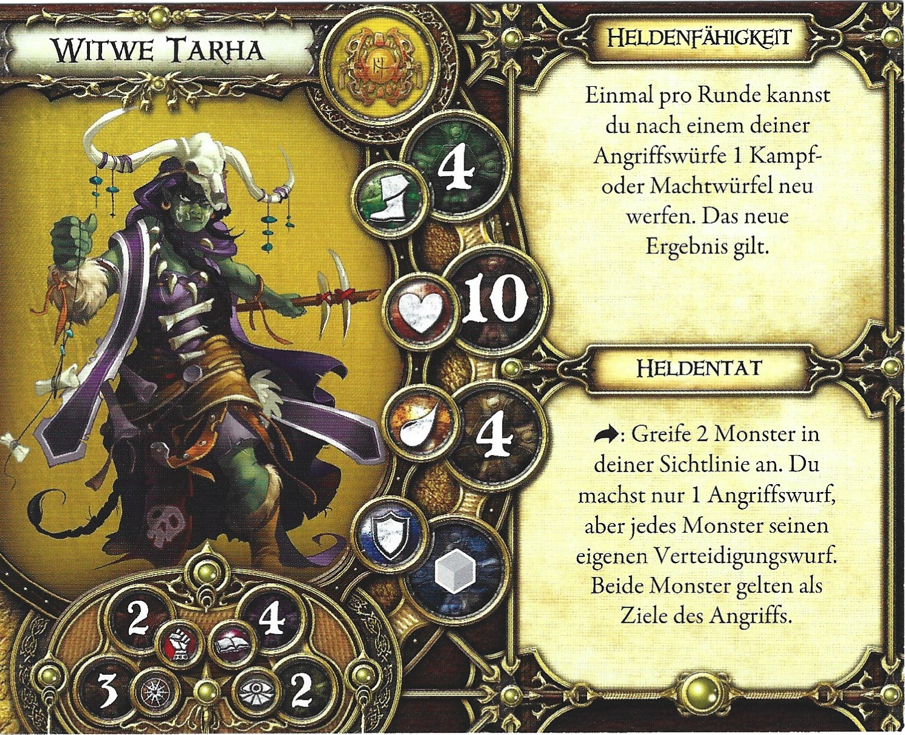

- **Archetyp:** Magier
- **Erweiterung:** Grundspiel
- **Gesundheit:** 10
- **Ausdauer:** 4
- **Geschwindigkeit:** 4
- **Verteidigung:** grau
- **Attribute:**
  - Stärke: 2
  - Willenskraft: 3
  - Wissen: 4
  - Gespür: 2

**Heldenfähigkeit:** Einmal pro Runde kannst du nach einem deiner Angriffswürfe 1 Kampf- oder Machtwürfel neu werfen. Das neue Ergebnis gilt.

**Heldentat:** [Aktion]: Greife 2 Monster in deiner Sichtlinie an. Du machst nur 1 Angriffswurf, aber jedes Monster macht seinen eigenen Verteidigungswurf. Beide Monster gelten als Ziele des Angriffs.

---

## Zyla

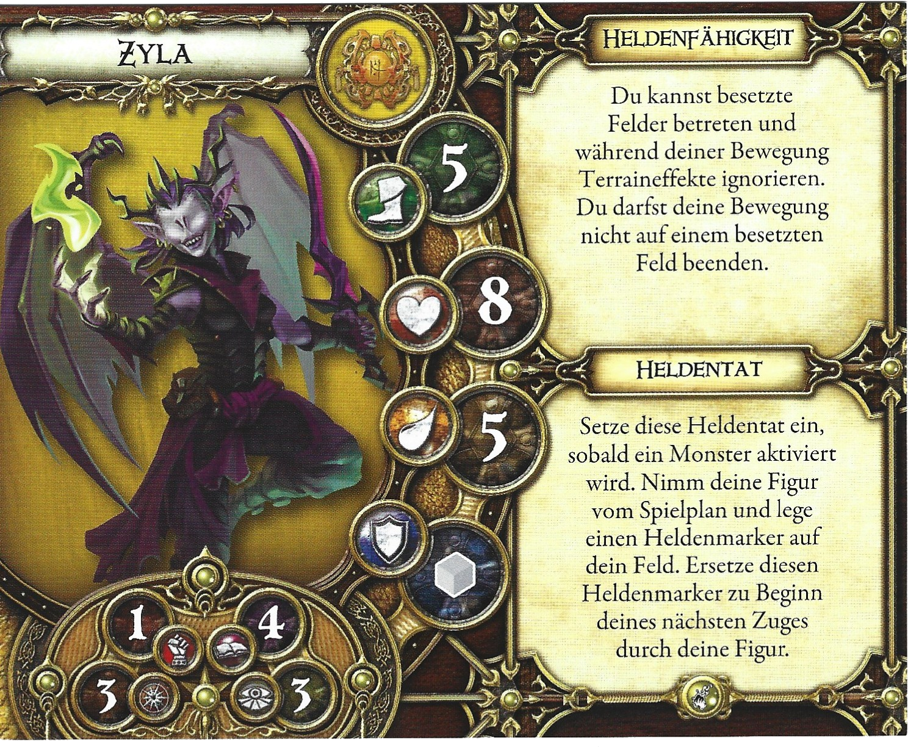

- **Archetyp:** Magier
- **Erweiterung:** Kontrakt der Unbesiegten
- **Gesundheit:** 8
- **Ausdauer:** 5
- **Geschwindigkeit:** 5
- **Verteidigung:** grau
- **Attribute:**
  - Stärke: 1
  - Willenskraft: 3
  - Wissen: 4
  - Gespür: 3

**Heldenfähigkeit:** Du kannst besetzte Felder betreten und während deiner Bewegung Terraineffekte ignorieren. Du darfst deine Bewegung nicht auf einem besetzten Feld beenden.

**Heldentat:** Setze diese Heldentat ein, sobald ein Monster aktiviert wird. Nimm deine Figur vom Spielplan und lege einen Heldenmarker auf dein Feld. Ersetze diesen Heldenmarker zu Beginn deines nächsten Zuges durch deine Figur.

---

